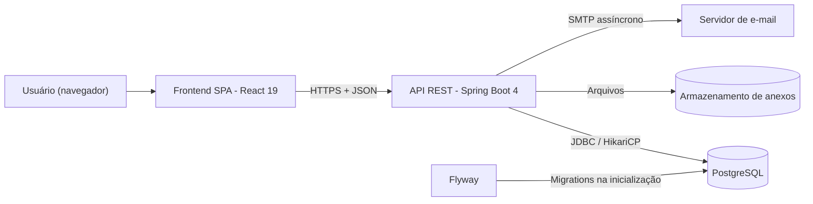
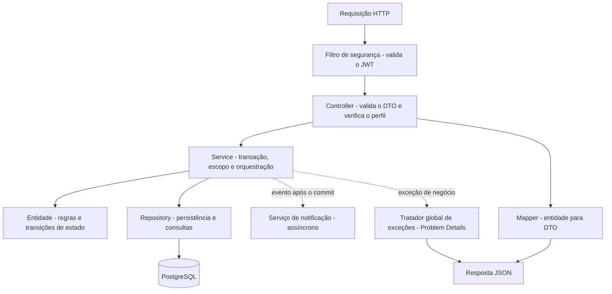
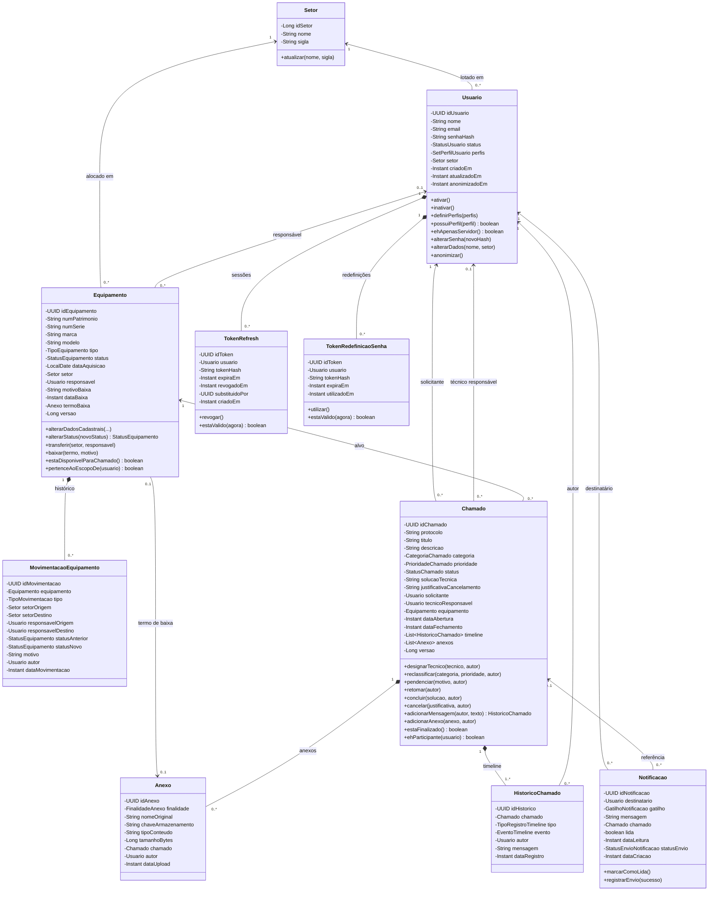
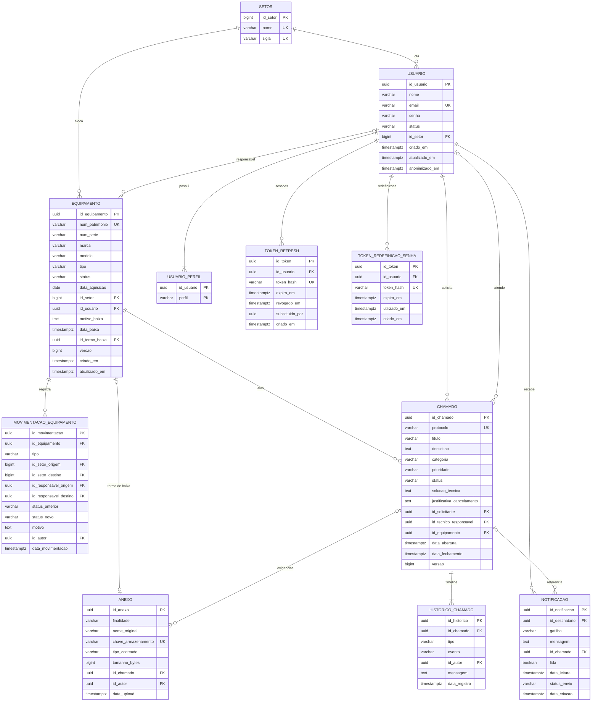

# Arquitetura, modelo de domínio e modelo de dados

* **Projeto:** X Solution - Sistema de gestão de ativos de TI e Service Desk
* **Versão do documento:** 2.1
* **Status:** Especificação aprovada para desenvolvimento
* **Data:** Outubro de 2026

> Este documento descreve a organização do backend, as responsabilidades de cada camada, o modelo de domínio e o modelo de dados alvo. Ele orienta a implementação, mas não contém implementação: nomes de classes e pacotes são o vocabulário comum da equipe.

---

## 1. Visão arquitetural

### 1.1. Contexto

### 1.2. Princípios
1. **Camadas com dependência em um único sentido:** controller → service → domínio e repository. Nenhuma camada inferior conhece uma camada superior.
2. **Domínio rico:** as regras de negócio que dizem respeito ao estado de uma entidade (transições de status, invariantes) ficam **dentro da entidade**. O service orquestra; a entidade decide se a mudança é válida.
3. **Entidades nunca saem da API:** controllers recebem e devolvem apenas DTOs. Isso evita vazamento de dados (como o hash da senha), problemas de carregamento tardio na serialização e acoplamento entre o contrato e o banco.
4. **Flyway é o dono do schema:** o mapeamento objeto-relacional apenas **valida** a estrutura na inicialização; nunca cria nem altera tabelas.
5. **Transação no service:** cada caso de uso é uma unidade transacional delimitada no service. Consultas usam transações somente leitura.
6. **Efeitos colaterais após o commit:** notificações e e-mails só são disparados depois que a transação principal é confirmada.
7. **Segurança em duas camadas:** autorização por perfil na entrada do endpoint e verificação de escopo (propriedade do recurso) no service.

### 1.3. Fluxo entre camadas

---

## 2. Estrutura de pacotes

Pacote raiz: **`com.xsolution`**. A organização é **por camada técnica**, com subpacotes por módulo quando o volume justificar (como em `dto`).

| Pacote | Responsabilidade | Conteúdo esperado |
| :--- | :--- | :--- |
| `com.xsolution` | Inicialização | Apenas a classe de inicialização da aplicação. |
| `domain.entity` | Entidades de domínio mapeadas para o banco | Setor, Usuario, Equipamento, MovimentacaoEquipamento, Chamado, HistoricoChamado, Anexo, Notificacao, TokenRefresh, TokenRedefinicaoSenha. |
| `domain.enums` | Vocabulário do domínio | Todas as enumerações listadas na seção 4.10. |
| `domain.exception` | Exceções de negócio | Exceções para recurso não encontrado, regra de negócio violada, transição inválida, recurso duplicado, recurso em uso e acesso negado ao escopo. Não dependem de HTTP. |
| `repository` | Acesso a dados | Uma interface de repositório por agregado ou entidade consultada de forma independente. Especificações de filtros dinâmicos. Projeções para listagens e dashboard. |
| `service` | Casos de uso | Um service por módulo (ver seção 7). |
| `controller` | Fronteira HTTP | Um controller por grupo de recursos do contrato da API. |
| `dto.<modulo>` | Contratos de entrada e saída | Requisições e respostas imutáveis por módulo: auth, usuario, setor, equipamento, chamado, timeline, anexo, notificacao, dashboard, comum (envelope de página, referências). |
| `mapper` | Conversão entidade ↔ DTO | Conversores sem regras de negócio. |
| `infra.security` | Segurança | Cadeia de filtros, filtro JWT, serviço de tokens, carregamento de usuário, utilitário de "usuário logado", tratadores de 401 e 403, limitador de tentativas. |
| `infra.exception` | Tratamento de erros | Tratador global que converte exceções em Problem Details, conforme o catálogo do contrato da API. |
| `infra.storage` | Armazenamento de arquivos | Abstração de armazenamento e implementação em sistema de arquivos local. |
| `infra.notification` | E-mail | Envio de e-mail assíncrono e modelos de mensagem. |
| `infra.config` | Configurações transversais | CORS, documentação OpenAPI, execução assíncrona, propriedades tipadas da aplicação, relógio do sistema. |

---

## 3. Diagrama de classes de domínio

---

## 4. Especificação das entidades

Convenções aplicáveis a todas as entidades:
* Identificadores UUID versão 7 são **gerados pela aplicação** antes da persistência (pesquisar o suporte nativo do Hibernate 7 a UUID versão 7 ou, alternativamente, a função nativa do PostgreSQL 18). Setor usa identidade gerada pelo banco.
* A igualdade entre instâncias de entidade é baseada exclusivamente no identificador.
* Entidades não expõem *setters* públicos genéricos: o estado muda por métodos com nome de negócio, que validam as invariantes.
* Associações para um (muitos-para-um) são carregadas sob demanda. Associações para muitos nunca são carregadas antecipadamente por padrão.
* Datas de criação e atualização são preenchidas automaticamente.

### 4.1. Setor
| Atributo | Tipo | Obrigatório | Regra |
| :--- | :--- | :---: | :--- |
| idSetor | inteiro longo | Sim | Identidade gerada pelo banco. |
| nome | texto (100) | Sim | Único, sem distinção de maiúsculas. |
| sigla | texto (20) | Sim | Única, armazenada em maiúsculas. |

**Comportamento:** `atualizar` normaliza nome e sigla.

### 4.2. Usuario
| Atributo | Tipo | Obrigatório | Regra |
| :--- | :--- | :---: | :--- |
| idUsuario | UUID v7 | Sim | Gerado pela aplicação. |
| nome | texto (255) | Sim | 3 a 255 caracteres. |
| email | texto (255) | Sim | Único, normalizado em minúsculas. |
| senhaHash | texto (255) | Sim | Hash BCrypt. Nunca serializado nem registrado em log. |
| status | StatusUsuario | Sim | Padrão `ATIVO`. |
| perfis | conjunto de PerfilUsuario | Sim | Ao menos um. Armazenado na tabela `usuario_perfil`. |
| setor | Setor | Sim | Muitos-para-um. |
| criadoEm / atualizadoEm | instante | Sim | Automáticos. |
| anonimizadoEm | instante | Não | Preenchido na anonimização. |

**Comportamento:**
* `definirPerfis` substitui o conjunto e rejeita conjunto vazio. A verificação do último administrador (RN05) **não** fica na entidade, pois depende de uma consulta global: é responsabilidade do service.
* `ehApenasServidor` indica que o usuário não possui `TECNICO` nem `ADMINISTRADOR`; é a base das regras de escopo RN12, RN13 e RN15.
* `anonimizar` aplica as substituições do RF07, inativa o usuário e registra a data.
* Os perfis são uma coleção de valores (não uma entidade). Como são lidos em toda autenticação, avaliar o carregamento junto com o usuário apenas na consulta de login, mantendo o carregamento sob demanda nas demais.

### 4.3. Equipamento
| Atributo | Tipo | Obrigatório | Regra |
| :--- | :--- | :---: | :--- |
| idEquipamento | UUID v7 | Sim | Gerado pela aplicação. |
| numPatrimonio | texto (100) | Sim | Único, maiúsculas, imutável. |
| numSerie, marca, modelo | texto (100) | Sim | - |
| tipo | TipoEquipamento | Sim | - |
| status | StatusEquipamento | Sim | Inicial `ESTOQUE` ou `EM_USO`. |
| dataAquisicao | data | Não | Não futura. |
| setor | Setor | Sim | - |
| responsavel | Usuario | Não | Sempre nulo em `ESTOQUE` e `BAIXADO`. |
| motivoBaixa, dataBaixa, termoBaixa | texto, instante, Anexo | Não | Obrigatórios em conjunto quando `BAIXADO`. |
| versao | inteiro longo | Sim | Concorrência otimista. |

**Comportamento:**
* `alterarStatus` aplica a máquina de estados da especificação (seção 6.2), lança exceção de transição inválida para destinos não permitidos, desvincula o responsável ao ir para `ESTOQUE` e devolve o status anterior (para o registro de movimentação).
* `transferir` rejeita equipamento baixado e destino idêntico à situação atual.
* `baixar` exige termo e motivo; a verificação de chamados abertos (RN11) é do service.
* `estaDisponivelParaChamado` é verdadeiro se, e somente se, o status for `EM_USO` (RN02).
* `pertenceAoEscopoDe(usuario)` é verdadeiro se o equipamento estiver no setor do usuário ou sob sua responsabilidade (RN12).

### 4.4. MovimentacaoEquipamento
Registro imutável, criado pelo service a cada cadastro, transferência, mudança de status ou baixa. Atributos conforme o diagrama; todos os campos de origem e destino são opcionais, exceto equipamento, tipo, autor e data.

### 4.5. Chamado (raiz de agregado)
| Atributo | Tipo | Obrigatório | Regra |
| :--- | :--- | :---: | :--- |
| idChamado | UUID v7 | Sim | Gerado pela aplicação. |
| protocolo | texto (50) | Sim | Único. Formato definido no RF12. |
| titulo | texto (255) | Sim | 5 a 255 caracteres. |
| descricao | texto longo | Sim | 10 a 5.000 caracteres. |
| categoria | CategoriaChamado | Sim | - |
| prioridade | PrioridadeChamado | Sim | Padrão `MEDIA`. |
| status | StatusChamado | Sim | Inicial `ABERTO`. |
| solucaoTecnica | texto longo | Condicional | Obrigatória se `CONCLUIDO`. |
| justificativaCancelamento | texto longo | Condicional | Obrigatória se `CANCELADO`. |
| solicitante | Usuario | Sim | Imutável. |
| tecnicoResponsavel | Usuario | Condicional | Obrigatório em `EM_ANDAMENTO`, `PENDENTE` e `CONCLUIDO`. |
| equipamento | Equipamento | Sim | Imutável. |
| dataAbertura | instante | Sim | Automática. |
| dataFechamento | instante | Condicional | Preenchida em `CONCLUIDO` e `CANCELADO`. |
| timeline | lista de HistoricoChamado | - | Composição. Só cresce. |
| anexos | lista de Anexo | - | Composição. Máximo de 10. |
| versao | inteiro longo | Sim | Concorrência otimista. |

**Comportamento:** cada método de transição:
1. verifica se o chamado não está finalizado (RN03);
2. verifica se a transição é permitida a partir do status atual (especificação, seção 6.1);
3. valida os dados exigidos (solução, justificativa, motivo);
4. altera o estado e as datas;
5. **adiciona o evento correspondente à timeline**, com o autor informado.

Como a timeline é composta pelo chamado, os registros são persistidos em cascata a partir dele. **Não** usar remoção de órfãos nem cascata de remoção na timeline: registros nunca são apagados.

As verificações de **quem** executa (técnico responsável, solicitante em `ABERTO`) dependem do usuário logado e ficam no service, que pode delegar à entidade métodos auxiliares de consulta, como `ehParticipante`.

> **Atenção ao tamanho da timeline:** a lista é útil para manter a consistência na gravação, mas a leitura da timeline pela API deve ser feita por consulta paginada no repositório, e não pela navegação na coleção do chamado.

### 4.6. HistoricoChamado
Registro imutável. `tipo` distingue mensagens humanas de eventos de sistema; `evento` é preenchido apenas quando o tipo é `EVENTO`. Não possui métodos de alteração.

### 4.7. Anexo
* `finalidade` indica se é evidência de chamado (`EVIDENCIA_CHAMADO`) ou termo de baixa (`TERMO_BAIXA`).
* Evidências de chamado têm `chamado` preenchido. Termos de baixa são referenciados pelo equipamento e não têm `chamado`.
* `chaveArmazenamento` é o nome interno gerado (UUID), independente do nome original, para evitar colisões e ataques por manipulação de caminho.
* O conteúdo binário nunca é armazenado no banco.

### 4.8. Notificacao
* Uma notificação por destinatário e por evento.
* `marcarComoLida` é idempotente e registra a data de leitura.
* `registrarEnvio` atualiza o status de envio do e-mail para `ENVIADO` ou `FALHA`.

### 4.9. TokenRefresh e TokenRedefinicaoSenha
* Ambos armazenam apenas o **hash** do token (por exemplo, SHA-256); o valor original só existe no cookie ou no link do e-mail.
* `TokenRefresh.substituidoPor` encadeia as rotações e permite detectar reutilização (RF02).
* Tokens expirados podem ser removidos por rotina de limpeza periódica (C).

### 4.10. Enumerações
| Enumeração | Valores | Observação |
| :--- | :--- | :--- |
| PerfilUsuario | `ADMINISTRADOR`, `TECNICO`, `SERVIDOR` | Persistida como texto. |
| StatusUsuario | `ATIVO`, `INATIVO` | - |
| TipoEquipamento | `COMPUTADOR`, `NOTEBOOK`, `MONITOR`, `IMPRESSORA`, `NOBREAK`, `ESTABILIZADOR`, `OUTRO` | - |
| StatusEquipamento | `EM_USO`, `ESTOQUE`, `EM_MANUTENCAO`, `BAIXADO` | Pode concentrar a tabela de transições permitidas. |
| TipoMovimentacao | `CADASTRO`, `TRANSFERENCIA`, `MUDANCA_STATUS`, `BAIXA` | - |
| StatusChamado | `ABERTO`, `EM_ANDAMENTO`, `PENDENTE`, `CONCLUIDO`, `CANCELADO` | Pode concentrar as transições permitidas e a noção de "terminal". |
| CategoriaChamado | `HARDWARE`, `SOFTWARE`, `REDE`, `ACESSO`, `OUTRO` | - |
| PrioridadeChamado | `BAIXA`, `MEDIA`, `ALTA`, `CRITICA` | A ordenação por prioridade não pode depender da ordem alfabética dos textos. |
| TipoRegistroTimeline | `MENSAGEM`, `EVENTO` | - |
| EventoTimeline | `ABERTURA`, `DESIGNACAO`, `RECLASSIFICACAO`, `PENDENCIA`, `RETOMADA`, `CONCLUSAO`, `CANCELAMENTO`, `ANEXO` | - |
| FinalidadeAnexo | `EVIDENCIA_CHAMADO`, `TERMO_BAIXA` | - |
| GatilhoNotificacao | `CHAMADO_ABERTO`, `CHAMADO_DESIGNADO`, `CHAMADO_STATUS_ALTERADO`, `CHAMADO_NOVA_MENSAGEM`, `CHAMADO_CONCLUIDO`, `CHAMADO_CANCELADO` | - |
| StatusEnvioNotificacao | `PENDENTE`, `ENVIADO`, `FALHA` | - |

Todas as enumerações são persistidas **como texto** (nunca pela posição ordinal), e as colunas correspondentes têm restrição de domínio no banco.

---

## 5. Modelo de dados alvo

### 5.1. Diagrama entidade-relacionamento

### 5.2. Diferenças entre a migration V1 e o modelo alvo

A migration `V1__criar_tabelas_iniciais.sql` cobre a base do modelo, mas não atende integralmente aos requisitos da versão 2.1. As diferenças abaixo devem ser tratadas em migrations Flyway.

| Tabela | Situação na V1 | Ajuste necessário | Requisito |
| :--- | :--- | :--- | :--- |
| `setor` | Sigla sem unicidade. | Restrição de unicidade na sigla. Unicidade do nome sem distinção de maiúsculas. | RF08 |
| `usuario` | Unicidade do e-mail sensível a maiúsculas. Sem data de atualização. | Garantir a unicidade sem distinção de maiúsculas (normalização na aplicação e/ou índice único sobre o e-mail em minúsculas). Incluir `atualizado_em` e `anonimizado_em`. | RF03, RF07 |
| `equipamento` | `tipo` sem restrição de domínio. Sem versão nem dados de baixa. | Restrição de domínio em `tipo` (incluindo `ESTABILIZADOR`). Incluir `versao`, `motivo_baixa`, `data_baixa`, `id_termo_baixa` e `atualizado_em`. Restrição garantindo que `BAIXADO` tenha os dados de baixa preenchidos. | RF09, RF10, RNF08 |
| `chamado` | Sem categoria, prioridade, solução técnica, justificativa e versão. | Incluir `categoria` e `prioridade` (com restrições de domínio), `solucao_tecnica`, `justificativa_cancelamento` e `versao`. Restrições: `CONCLUIDO` exige solução e data de fechamento; `CANCELADO` exige justificativa e data de fechamento. | RF12 a RF18 |
| `historico_chamado` | Sem distinção entre mensagem e evento. Coluna de data chamada `data_alteracao`. | Incluir `tipo` e `evento` com restrições de domínio. Renomear a coluna de data para `data_registro`. | RF15 |
| `anexo` | Apenas nome e extensão, vinculado obrigatoriamente a chamado. | Substituir por `nome_original`, `chave_armazenamento`, `tipo_conteudo`, `tamanho_bytes`, `id_autor`, `data_upload` e `finalidade`. Tornar `id_chamado` opcional, com restrição: evidência exige chamado e termo de baixa não tem chamado. | RF10, RF17 |
| `notificacao` | Campos `tipo` e `gatilho` livres, sem vínculo com chamado. | Remover `tipo`. Restrição de domínio em `gatilho` e `status_envio`. Incluir `id_chamado` e `data_leitura`. Renomear `data_envio` para `data_criacao`. | RF19 |
| `movimentacao_equipamento` | Inexistente. | Criar. | RF11 |
| `token_refresh` | Inexistente. | Criar. | RF02 |
| `token_redefinicao_senha` | Inexistente. | Criar. | RF04 |
| Carga inicial | Inexistente. | Migration de dados com setor inicial e primeiro administrador, com senha a ser trocada na implantação (o hash nunca deve corresponder a uma senha conhecida em produção). | Premissas |

### 5.3. Índices recomendados
Além das chaves primárias e restrições de unicidade (que já criam índices), criar índices para as colunas de chave estrangeira e de filtro frequente:

| Tabela | Colunas | Motivo |
| :--- | :--- | :--- |
| `usuario` | `id_setor` | Filtro por setor e verificação de remoção de setor. |
| `equipamento` | `id_setor`, `id_usuario`, `status` | Filtros do inventário e escopo RN12. |
| `chamado` | `status` com `prioridade` e `data_abertura` | Ordenação padrão da fila. |
| `chamado` | `id_solicitante`, `id_tecnico_responsavel`, `id_equipamento` | "Meus chamados", "atribuídos a mim", RN11. |
| `historico_chamado` | `id_chamado` com `data_registro` | Leitura paginada da timeline. |
| `movimentacao_equipamento` | `id_equipamento` com `data_movimentacao` | Histórico do ativo. |
| `notificacao` | `id_destinatario` com `lida` | Contagem de não lidas. |
| `token_refresh` | `id_usuario` | Revogação em massa. |

### 5.4. Políticas de remoção
* `usuario`, `equipamento` e `chamado` nunca são removidos fisicamente: as chaves estrangeiras que apontam para eles usam restrição de remoção.
* `usuario_perfil`, `token_refresh` e `token_redefinicao_senha` acompanham o usuário (remoção em cascata, que só ocorreria em manutenção administrativa).
* `historico_chamado` e `anexo` nunca são removidos pela aplicação.

---

## 6. Repositórios

Cada repositório estende o repositório JPA padrão do Spring Data. A tabela lista as consultas exigidas pelos requisitos; os nomes são indicativos.

| Repositório | Consulta necessária | Uso |
| :--- | :--- | :--- |
| SetorRepository | Verificar existência por nome (sem distinção de maiúsculas) e por sigla. | RF08 - unicidade. |
| | Listar todos ordenados por nome. | Listagem pública. |
| UsuarioRepository | Buscar por e-mail, carregando os perfis. | Login. |
| | Verificar existência por e-mail. | Cadastro. |
| | Contar usuários ativos com determinado perfil. | RN05. |
| | Contar usuários por setor. | Remoção de setor. |
| | Listar ativos com o perfil `TECNICO`. | Designação. |
| | Listagem paginada com filtros dinâmicos. | RF06. |
| EquipamentoRepository | Buscar por número de patrimônio. Verificar existência por patrimônio. | RF09. |
| | Listagem paginada com filtros dinâmicos, carregando setor e responsável sem consultas adicionais. | Inventário. |
| | Listar elegíveis para chamado com escopo (status `EM_USO`, setor do usuário ou responsável igual ao usuário). | RN12. |
| | Contar por status. Contar por setor. | Dashboard e remoção de setor. |
| MovimentacaoEquipamentoRepository | Listagem paginada por equipamento, ordenada por data decrescente. | RF11. |
| ChamadoRepository | Buscar por protocolo. Verificar existência por protocolo. | RF12. |
| | Listagem paginada com filtros dinâmicos, carregando solicitante, técnico e equipamento sem consultas adicionais. | Fila. |
| | Listagem paginada por solicitante. | "Meus chamados". |
| | Verificar existência de chamados não terminais por equipamento. | RN11. |
| | Contagens por status, por status no período, por técnico, agrupamentos por setor e por prioridade. | Dashboard. |
| | Consulta por período para relatório, com projeção das colunas exportadas. | RF21. |
| HistoricoChamadoRepository | Listagem paginada por chamado, ordenada por data. | Timeline. |
| AnexoRepository | Listar por chamado. Contar por chamado. | RF17. |
| NotificacaoRepository | Listagem paginada por destinatário. Contar não lidas por destinatário. Marcar todas como lidas por destinatário em uma única atualização. | RF19. |
| TokenRefreshRepository | Buscar por hash. Revogar todos os ativos de um usuário. | RF02. |
| TokenRedefinicaoSenhaRepository | Buscar por hash. Invalidar pendentes de um usuário. | RF04. |

**Diretrizes:**
* Filtros combináveis devem ser montados dinamicamente (pesquisar *Specifications* do Spring Data JPA ou consultas por critérios), em vez de criar um método para cada combinação.
* Listagens nunca devem disparar uma consulta por linha para carregar associações (problema N+1). Pesquisar *entity graphs*, *fetch join* e projeções baseadas em interface ou em registros.
* Paginação com *fetch join* de coleções gera paginação em memória: para coleções, preferir consultas separadas.
* Busca sem distinção de acentos exige suporte do banco (pesquisar a extensão `unaccent` do PostgreSQL) - decisão a validar pela equipe.

---

## 7. Serviços (casos de uso)

| Service | Responsabilidades | Requisitos |
| :--- | :--- | :--- |
| AuthService | Login, emissão e rotação de tokens, logout, auto-cadastro, recuperação e redefinição de senha. | RF01 a RF04 |
| UsuarioService | Perfil próprio, gestão administrativa, regra do último administrador, anonimização, listagem de técnicos. | RF05 a RF07 |
| SetorService | Cadastro de setores e verificação de vínculos antes da remoção. | RF08 |
| EquipamentoService | Cadastro, edição, transições, transferência, baixa, registro de movimentações, consultas com escopo. | RF09 a RF11 |
| ChamadoService | Abertura (incluindo geração de protocolo), fila, designação, classificação, pendência, retomada, conclusão, cancelamento, timeline, verificações de escopo e de autoria. | RF12 a RF16, RF18 |
| AnexoService | Validação, armazenamento e download de arquivos, vínculo com chamado ou equipamento. | RF10, RF17 |
| NotificacaoService | Escuta dos eventos de domínio após o commit, criação das notificações, envio assíncrono de e-mails, consultas e marcação de leitura. | RF19 |
| DashboardService | Cálculo dos indicadores. | RF20 |
| RelatorioService | Geração dos arquivos CSV e PDF. | RF21 |

**Diretrizes:**
* Métodos de escrita são transacionais; métodos de leitura são transacionais somente leitura.
* O service obtém o usuário logado a partir do contexto de segurança (por meio de um componente utilitário), e nunca a partir de um identificador enviado pelo cliente.
* Ao final de cada caso de uso que precise notificar, o service **publica um evento de domínio** (ex.: "chamado aberto") em vez de chamar diretamente o serviço de notificação. O ouvinte é executado somente após o commit e de forma assíncrona (pesquisar ouvintes de eventos transacionais do Spring e execução assíncrona com *pool* de *threads* configurado).
* O instante atual é obtido de um relógio injetável, o que permite testar regras de data (expiração de tokens, protocolo, "mês corrente") de forma determinística.

---

## 8. Controllers

| Controller | Recurso do contrato |
| :--- | :--- |
| AuthController | `/auth` |
| MeController | `/me` |
| UsuarioController | `/usuarios` |
| SetorController | `/setores` |
| EquipamentoController | `/equipamentos` |
| ChamadoController | `/chamados` (incluindo ações) |
| TimelineController | `/chamados/{id}/mensagens` |
| AnexoController | `/chamados/{id}/anexos` e `/anexos` |
| NotificacaoController | `/notificacoes` |
| DashboardController | `/dashboard` |
| RelatorioController | `/relatorios` |

**Diretrizes:** controllers validam o DTO, declaram os perfis exigidos, delegam ao service e escolhem o status HTTP. Não contêm regra de negócio, não acessam repositórios e não capturam exceções de negócio (isso é papel do tratador global).

---

## 9. Infraestrutura transversal

### 9.1. Segurança
* Cadeia de filtros stateless: sem sessão HTTP, proteção CSRF desabilitada para os endpoints que usam apenas o cabeçalho `Authorization`. Para os endpoints `/auth/refresh` e `/auth/logout`, que dependem de cookie, a proteção é garantida pelo atributo `SameSite=Strict` e pela política de CORS restrita.
* Filtro JWT executado uma vez por requisição: extrai o token do cabeçalho, valida assinatura e expiração e popula o contexto de segurança com o identificador do usuário e seus perfis.
* Autorização por método habilitada, com expressões de perfil declaradas nos controllers.
* Respostas 401 e 403 produzidas por componentes próprios, no formato Problem Details.
* Codificador de senha BCrypt com custo 12.
* Limitador de tentativas de login por e-mail (RN16), em memória na Release 2.0 (com a limitação conhecida de não ser compartilhado entre instâncias).

### 9.2. Tratamento de erros
Tratador global que converte:
* exceções de validação de DTO em `validacao` (400) com a lista de campos;
* exceções de domínio em seus respectivos tipos do catálogo (404, 409, 422);
* violação de unicidade do banco em `recurso-duplicado` (409), como proteção adicional às verificações prévias, já que duas requisições simultâneas podem passar pela verificação;
* conflito de versão otimista em `conflito-concorrencia` (409);
* qualquer outra exceção em `erro-interno` (500), registrando a pilha completa no log com o identificador de correlação, mas nunca na resposta.

### 9.3. Configuração
* Arquivo de propriedades principal com valores comuns e perfis por ambiente (desenvolvimento, teste, produção).
* Credenciais do banco, segredo do JWT, origens CORS, diretório de anexos e dados do SMTP lidos de variáveis de ambiente, com valores padrão apenas para o ambiente local.
* Validação do mapeamento objeto-relacional ativada; geração automática de schema desativada.
* Desativar o padrão *open session in view* para que nenhuma consulta ocorra fora da camada de serviço.
* Limite de tamanho de upload configurado em 10 MB por arquivo.

### 9.4. Armazenamento de anexos
Abstração com as operações salvar, abrir e remover, recebendo e devolvendo a chave de armazenamento. Implementação inicial em diretório local configurável, organizado por ano e mês. A abstração permite migrar para armazenamento de objetos sem alterar os services.

---

## 10. Responsabilidades por camada

| Camada | Faz | Não faz |
| :--- | :--- | :--- |
| **Controller** | Recebe e valida o DTO, verifica o perfil, delega ao service, devolve DTO e status HTTP. | Não contém regras de negócio, não acessa repositórios, não manipula entidades diretamente. |
| **Service** | Delimita a transação, identifica o usuário logado, verifica escopo e autoria, carrega entidades, invoca métodos de domínio, persiste, publica eventos, converte para DTO (via mapper). | Não conhece objetos HTTP, cabeçalhos ou JSON. |
| **Entidade** | Encapsula o estado, garante invariantes, executa transições válidas e registra eventos na própria timeline. | Não acessa repositórios, services ou o contexto de segurança. |
| **Repository** | Executa consultas e persistência. | Não valida regras de negócio. |
| **Mapper** | Converte entidade em DTO e DTO em parâmetros de criação. | Não consulta o banco, não aplica regras. |
| **Infra** | Segurança, erros, armazenamento, e-mail e configuração. | Não implementa casos de uso. |

---

## 11. Convenções de nomenclatura

| Elemento | Convenção | Exemplo |
| :--- | :--- | :--- |
| Tabelas e colunas | snake_case, singular | `historico_chamado`, `data_abertura` |
| Chaves primárias | `id_` + nome da tabela | `id_chamado` |
| Restrições | prefixo do tipo + tabela + coluna | `fk_chamado_equipamento`, `uk_setor_sigla`, `ck_chamado_status` |
| Índices | `idx_` + tabela + colunas | `idx_chamado_status_prioridade` |
| Migrations | `V<n>__<descricao_em_snake_case>` | `V2__ajustar_modelo_release_2_1` |
| Classes | PascalCase, em português | `ChamadoService` |
| DTOs de entrada | ação + recurso + `Request` | `CriarChamadoRequest` |
| DTOs de saída | recurso + forma + `Response` | `ChamadoDetalheResponse` |
| Métodos de domínio | verbo no infinitivo, linguagem de negócio | `concluir`, `pendenciar` |
