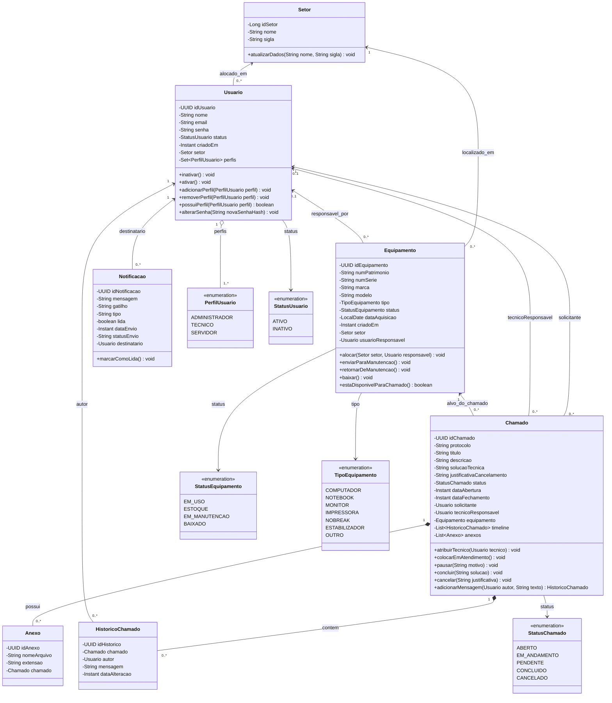

# Diagrama de Classes e Arquitetura de Pacotes — X Solution

**Projeto:** X Solution — Sistema de Gestão de Ativos de TI e Service Desk  
**Versão do Modelo:** 2.0 (Modernizado para Spring Boot 4 + JPA)  
**Status:** Especificação Aprovada para Desenvolvimento  
**Data:** Outubro de 2026  

---

## 1. Visão Arquitetural e Estrutura de Pacotes

O backend adota uma arquitetura em camadas concêntricas (**Clean / Layered Architecture**) sob o pacote raiz **`com.xsolution`**, separando rigorosamente o domínio de negócio dos detalhes de infraestrutura e protocolos web.

```
src/main/java/com/xsolution/
├── XsolutionApplication.java          # Ponto de entrada Spring Boot (@SpringBootApplication)
│
├── domain/                            # NÚCLEO DO DOMÍNIO (Independente de Frameworks Web)
│   ├── entity/                        # Entidades JPA (@Entity) com lógica de domínio rica
│   │   ├── Setor.java
│   │   ├── Usuario.java
│   │   ├── Equipamento.java
│   │   ├── Chamado.java
│   │   ├── HistoricoChamado.java
│   │   ├── Anexo.java
│   │   └── Notificacao.java
│   │
│   └── enums/                         # Vocabulário e Máquinas de Estado
│       ├── PerfilUsuario.java
│       ├── StatusUsuario.java
│       ├── StatusEquipamento.java
│       ├── TipoEquipamento.java
│       └── StatusChamado.java
│
├── repository/                        # CAMADA DE ACESSO A DADOS (Spring Data JPA)
│   ├── SetorRepository.java
│   ├── UsuarioRepository.java
│   ├── EquipamentoRepository.java
│   ├── ChamadoRepository.java
│   ├── HistoricoChamadoRepository.java
│   ├── AnexoRepository.java
│   └── NotificacaoRepository.java
│
├── service/                           # CASOS DE USO E REGRAS DE NEGÓCIO (@Service)
│   ├── AuthService.java
│   ├── UsuarioService.java
│   ├── SetorService.java
│   ├── EquipamentoService.java
│   ├── ChamadoService.java
│   ├── NotificacaoService.java
│   └── DashboardService.java
│
├── controller/                        # FRONTEIRA WEB / REST CONTROLLERS (@RestController)
│   ├── AuthController.java
│   ├── MeController.java
│   ├── UsuarioController.java
│   ├── SetorController.java
│   ├── EquipamentoController.java
│   ├── ChamadoController.java
│   ├── NotificacaoController.java
│   └── DashboardController.java
│
├── dto/                               # CONTRATOS DE TRANSFERÊNCIA (Java 21 Records)
│   ├── auth/                          # LoginRequest, AuthResponse, RegisterRequest...
│   ├── usuario/                       # UsuarioResponse, AtualizarPerfisRequest...
│   ├── setor/                         # SetorResponse, CriarSetorRequest...
│   ├── equipamento/                   # EquipamentoResponse, CriarEquipamentoRequest...
│   ├── chamado/                       # ChamadoResponse, CriarChamadoRequest, ConcluirRequest...
│   └── dashboard/                     # DashboardMetricasResponse...
│
└── infra/                             # INFRAESTRUTURA E CONFIGURAÇÕES TRANSVERSAIS
    ├── security/                      # SecurityFilterChain, JwtService, UserDetailsService
    ├── exception/                     # GlobalExceptionHandler, ProblemDetail (RFC 7807)
    └── config/                        # OpenAPI/Swagger Config, CORS Config, Auditing
```

---

## 2. Diagrama de Classes de Domínio (Mermaid)



---

## 3. Especificação Detalhada das Entidades de Domínio

### 3.1. Entidade: `Usuario`
Centraliza a identidade, credenciais e papéis no sistema. Adota o padrão **Rich Domain Model** (regras de validação encapsuladas).

* **Anotações JPA:** `@Entity`, `@Table(name = "usuario")`.
* **Atributos:**
  * `@Id private UUID idUsuario`: Chave primária UUIDv7.
  * `@Column(nullable = false) private String nome`.
  * `@Column(nullable = false, unique = true) private String email`.
  * `@Column(nullable = false) private String senha`: Hash BCrypt.
  * `@Enumerated(EnumType.STRING) private StatusUsuario status`: `ATIVO` ou `INATIVO`.
  * `@CreationTimestamp private Instant criadoEm`.
  * `@ManyToOne(fetch = FetchType.LAZY) @JoinColumn(name = "id_setor") private Setor setor`.
  * `@ElementCollection(fetch = FetchType.EAGER) @CollectionTable(name = "usuario_perfil", joinColumns = @JoinColumn(name = "id_usuario")) @Enumerated(EnumType.STRING) @Column(name = "perfil") private Set<PerfilUsuario> perfis = new HashSet<>()`.
* **Métodos de Domínio:**
  * `inativar()`: Altera status para `INATIVO`.
  * `possuiPerfil(PerfilUsuario p)`: Verifica se o usuário contém o papel informado.
  * `adicionarPerfil(PerfilUsuario p)` / `removerPerfil(PerfilUsuario p)`: Mantém a consistência da coleção.

---

### 3.2. Entidade: `Equipamento`
Representa os ativos de hardware sob governança patrimonial.

* **Anotações JPA:** `@Entity`, `@Table(name = "equipamento")`.
* **Atributos:**
  * `@Id private UUID idEquipamento`.
  * `@Column(nullable = false, unique = true) private String numPatrimonio`.
  * `@Column(nullable = false) private String numSerie`.
  * `@Column(nullable = false) private String marca`.
  * `@Column(nullable = false) private String modelo`.
  * `@Enumerated(EnumType.STRING) private TipoEquipamento tipo`.
  * `@Enumerated(EnumType.STRING) private StatusEquipamento status`.
  * `private LocalDate dataAquisicao`.
  * `@CreationTimestamp private Instant criadoEm`.
  * `@ManyToOne(fetch = FetchType.LAZY) @JoinColumn(name = "id_setor", nullable = false) private Setor setor`.
  * `@ManyToOne(fetch = FetchType.LAZY) @JoinColumn(name = "id_usuario") private Usuario usuarioResponsavel`.
* **Métodos de Domínio:**
  * `estaDisponivelParaChamado()`: Retorna `true` se e somente se `status == StatusEquipamento.EM_USO` (**RN02**).
  * `baixar()`: Altera status para `BAIXADO`, desvincula o responsável e valida a irreversibilidade (**RN04**).
  * `alocar(Setor s, Usuario u)`: Altera setor e responsável, mudando status para `EM_USO`.

---

### 3.3. Entidade: `Chamado`
Agregado central do Service Desk. Gerencia seu próprio ciclo de vida e a composição com histórico e anexos.

* **Anotações JPA:** `@Entity`, `@Table(name = "chamado")`.
* **Atributos:**
  * `@Id private UUID idChamado`.
  * `@Column(nullable = false, unique = true) private String protocolo`.
  * `@Column(nullable = false) private String titulo`.
  * `@Column(nullable = false, columnDefinition = "TEXT") private String descricao`.
  * `@Column(columnDefinition = "TEXT") private String solucaoTecnica`.
  * `@Column(columnDefinition = "TEXT") private String justificativaCancelamento`.
  * `@Enumerated(EnumType.STRING) private StatusChamado status`.
  * `@CreationTimestamp private Instant dataAbertura`.
  * `private Instant dataFechamento`.
  * `@ManyToOne(fetch = FetchType.LAZY) @JoinColumn(name = "id_solicitante", nullable = false) private Usuario solicitante`.
  * `@ManyToOne(fetch = FetchType.LAZY) @JoinColumn(name = "id_tecnico_responsavel") private Usuario tecnicoResponsavel`.
  * `@ManyToOne(fetch = FetchType.LAZY) @JoinColumn(name = "id_equipamento", nullable = false) private Equipamento equipamento`.
  * `@OneToMany(mappedBy = "chamado", cascade = CascadeType.ALL, orphanRemoval = true) @OrderBy("dataAlteracao ASC") private List<HistoricoChamado> timeline = new ArrayList<>()`.
  * `@OneToMany(mappedBy = "chamado", cascade = CascadeType.ALL, orphanRemoval = true) private List<Anexo> anexos = new ArrayList<>()`.
* **Métodos de Domínio:**
  * `atribuirTecnico(Usuario tecnico)`: Vincula técnico e move status para `EM_ANDAMENTO` caso estivesse `ABERTO`.
  * `concluir(String solucao)`: Valida se status atual não é terminal (**RN03**), exige solução técnica preenchida (**RN07**), define `dataFechamento = Instant.now()` e transiciona para `CONCLUIDO`.
  * `cancelar(String justificativa)`: Valida se status atual não é terminal, exige justificativa (**RN08**), define `dataFechamento = Instant.now()` e transiciona para `CANCELADO`.

---

### 3.4. Entidade: `HistoricoChamado`
Item imutável da timeline de mensagens e eventos do chamado.

* **Anotações JPA:** `@Entity`, `@Table(name = "historico_chamado")`.
* **Atributos:**
  * `@Id private UUID idHistorico`.
  * `@ManyToOne(fetch = FetchType.LAZY) @JoinColumn(name = "id_chamado", nullable = false) private Chamado chamado`.
  * `@ManyToOne(fetch = FetchType.LAZY) @JoinColumn(name = "id_autor", nullable = false) private Usuario autor`.
  * `@Column(nullable = false, columnDefinition = "TEXT") private String mensagem`.
  * `@CreationTimestamp private Instant dataAlteracao`.

---

## 4. Especificação dos Repositories (Spring Data JPA)

As interfaces estendem `JpaRepository<Entidade, TipoID>` e declaram consultas derivadas e projeções otimizadas:

```java
public interface UsuarioRepository extends JpaRepository<Usuario, UUID> {
    Optional<Usuario> findByEmail(String email);
    boolean existsByEmail(String email);
    long countByPerfisContainingAndStatus(PerfilUsuario perfil, StatusUsuario status);
    Page<Usuario> findByNomeContainingIgnoreCase(String nome, Pageable pageable);
}

public interface EquipamentoRepository extends JpaRepository<Equipamento, UUID> {
    Optional<Equipamento> findByNumPatrimonio(String numPatrimonio);
    boolean existsByNumPatrimonio(String numPatrimonio);
    Page<Equipamento> findByStatus(StatusEquipamento status, Pageable pageable);
    Page<Equipamento> findBySetorIdSetor(Long idSetor, Pageable pageable);
}

public interface ChamadoRepository extends JpaRepository<Chamado, UUID> {
    Optional<Chamado> findByProtocolo(String protocolo);
    Page<Chamado> findBySolicitanteIdUsuario(UUID idSolicitante, Pageable pageable);
    Page<Chamado> findByTecnicoResponsavelIdUsuario(UUID idTecnico, Pageable pageable);
    Page<Chamado> findByStatus(StatusChamado status, Pageable pageable);
    long countByStatus(StatusChamado status);
}

public interface SetorRepository extends JpaRepository<Setor, Long> {
    Optional<Setor> findByNomeIgnoreCase(String nome);
    boolean existsByNomeIgnoreCase(String nome);
}
```

---

## 5. Mapeamento de Responsabilidades (Boundary-Control-Entity no Spring)

A tabela abaixo demonstra como o fluxo de execução respeita o isolamento de camadas:

| Camada | Responsabilidade Técnica | O Que Faz | O Que NÃO Faz |
| :--- | :--- | :--- | :--- |
| **`Controller`** | Boundary (HTTP) | Recebe DTO, valida com `@Valid`, chama o Service, retorna DTO e Status HTTP. | Não contém regras de negócio nem acessa repositório diretamente. |
| **`Service`** | Control (Caso de Uso) | Orquestra transações (`@Transactional`), valida permissões, invoca entidades e dispara notificações. | Não lida com `HttpServletRequest`, JSON ou cabeçalhos HTTP. |
| **`Entity`** | Entity (Domínio) | Encapsula estado, garante invariantes de negócio e executa transições válidas. | Não conhece Repositories, Services ou controllers. |
| **`Repository`** | Infra (Persistência) | Executa queries SQL/JPQL otimizadas e gerencia concorrência com o PostgreSQL. | Não valida regras de negócio de aplicação. |
