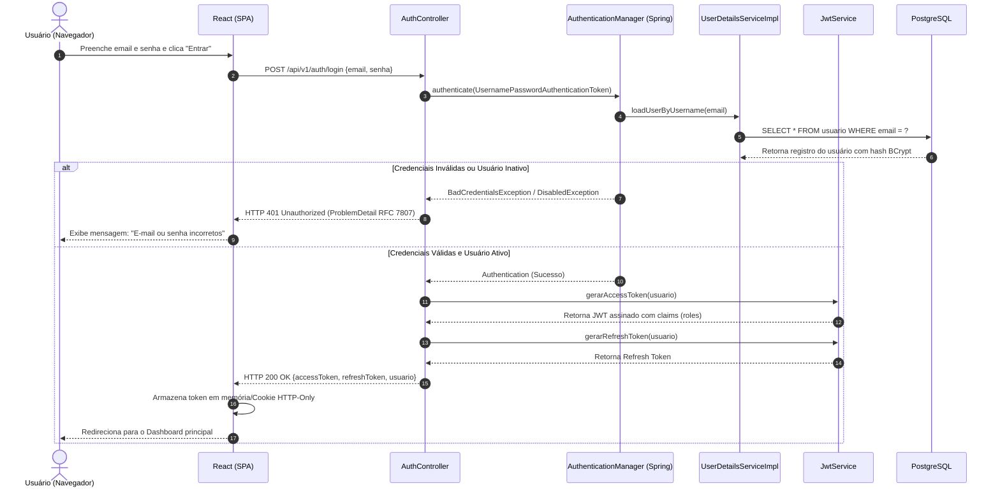
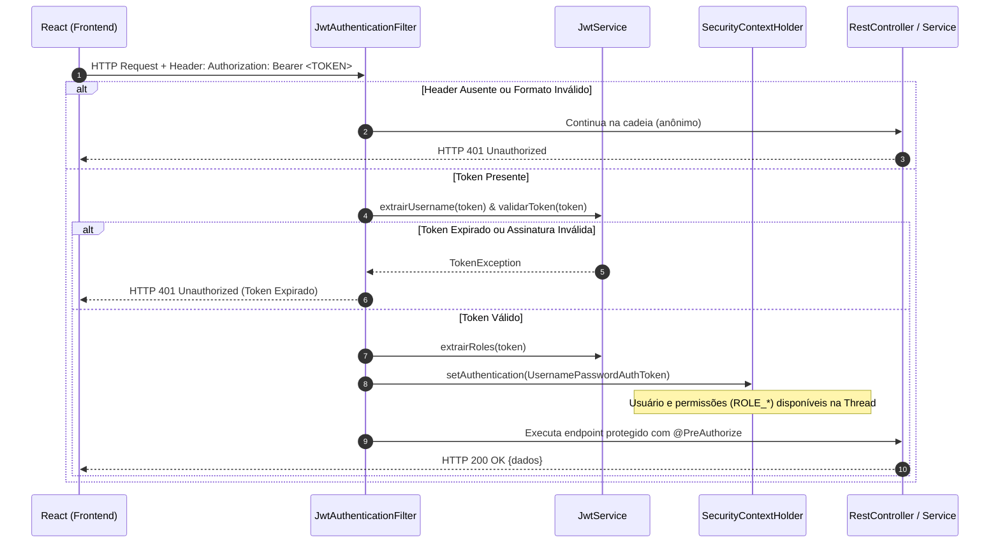
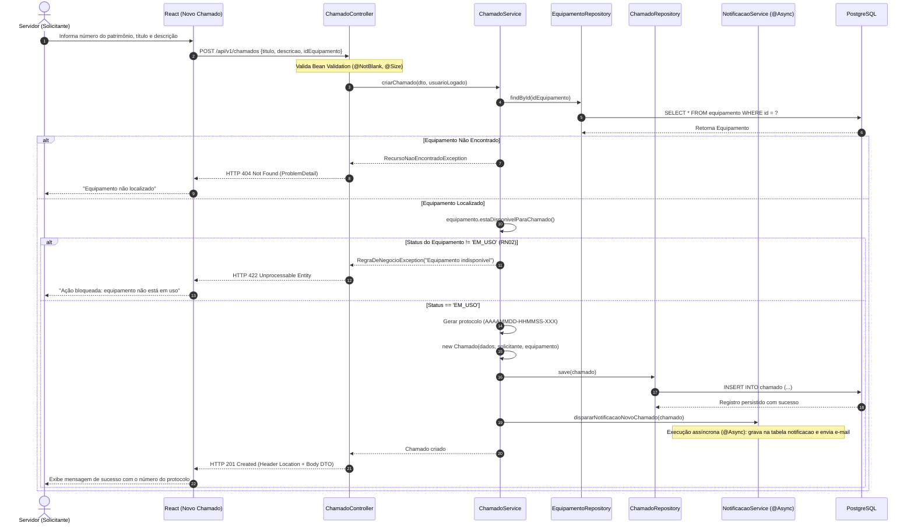
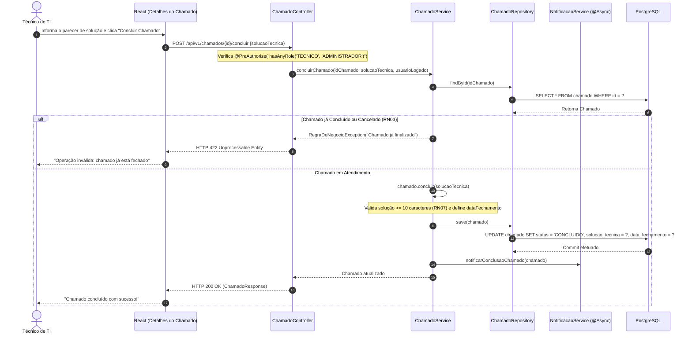
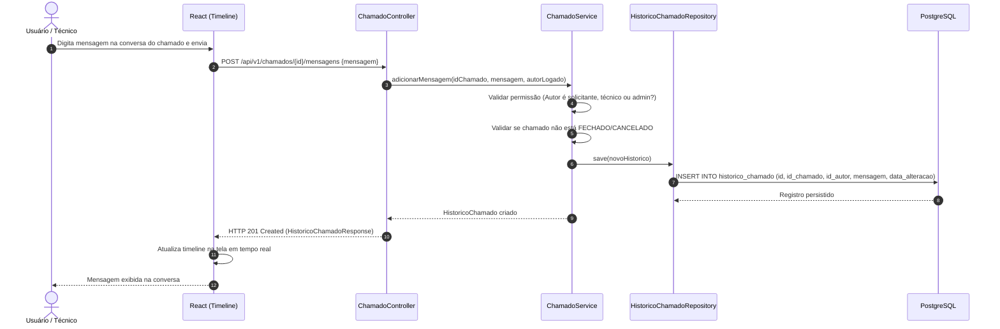
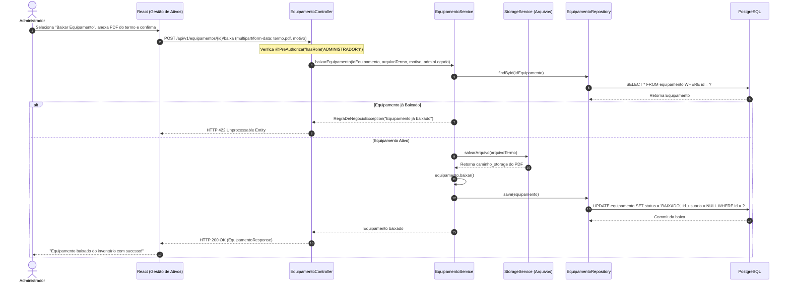

# Diagramas de Sequência Web — X Solution

**Projeto:** X Solution — Sistema de Gestão de Ativos de TI e Service Desk  
**Versão:** 2.0 (Arquitetura Distribuída / RESTful & JWT)  
**Status:** Especificação Aprovada para Desenvolvimento  
**Data:** Outubro de 2026  

---

## 1. Visão Geral dos Fluxos Dinâmicos

Diferente do sistema legado desktop, onde chamadas ocorriam em memória local entre classes FXML e DAOs, a arquitetura moderna opera sobre o protocolo **HTTP**, com tráfego **JSON**, autenticação **Stateless via JWT**, transações atômicas gerenciadas pelo Spring (`@Transactional`) e disparos assíncronos (`@Async`).

Este documento especifica o comportamento temporal e a colaboração entre os componentes para os cenários operacionais mais críticos.

---

## 2. Diagrama 1: Autenticação Stateless e Emissão de Token JWT

Demonstra o fluxo de login a partir do formulário React até a emissão das chaves criptográficas.

---

## 3. Diagrama 2: Pipeline de Segurança — Validação de Requisições com JWT

Ilustra como cada requisição protegida enviada pelo React é interceptada e validada pelo Spring Security antes de atingir qualquer `@RestController`.

---

## 4. Diagrama 3: Abertura de Chamado com Validação de Ativo Elegível

Representa a criação de um ticket vinculada à validação estrita da regra de negócio **RN02** e ao disparo de evento de notificação assíncrono.

---

## 5. Diagrama 4: Conclusão de Chamado com Solução Técnica Obrigatória

Modela o encerramento formal do ticket com validação das regras **RN03** (imutabilidade) e **RN07** (parecer obrigatório de solução técnica).

---

## 6. Diagrama 5: Interação Colaborativa na Timeline de Atendimento

Mostra a inclusão de mensagens e pareceres intermediários entre o servidor e o técnico responsável (`historico_chamado`).

---

## 7. Diagrama 6: Baixa Patrimonial com Upload de Termo de Descarte

Mapeia o fluxo de exclusão lógica irreversível de um ativo (`BAIXADO`), com envio de arquivo via `multipart/form-data` (**RN04**).

