# Diagramas de Sequência Web

* **Projeto:** X Solution - Sistema de gestão de ativos de TI e Service Desk
* **Versão do documento:** 2.0
* **Arquitetura:** distribuída, REST e JWT
* **Data:** Outubro de 2026

---

## 1. Visão geral

No sistema legado desktop, as telas chamavam as classes de acesso a dados diretamente, na mesma memória. Na arquitetura atual, toda interação atravessa a rede via **HTTP com JSON**, a autenticação é **stateless** (cada requisição carrega seu próprio token), cada caso de uso é uma **transação atômica** delimitada no service e os efeitos colaterais (notificações e e-mails) ocorrem **de forma assíncrona após o commit**.

Este documento descreve a colaboração temporal entre os componentes nos fluxos críticos. Os diagramas usam linguagem de negócio; os nomes de componentes seguem o documento de arquitetura e os endpoints seguem o catálogo de contratos.

### 1.1. Participantes recorrentes
| Participante | Papel |
| :--- | :--- |
| **SPA (React)** | Interface do usuário. Mantém o access token em memória e trata respostas 401 renovando as credenciais. |
| **Filtro JWT** | Valida o access token de cada requisição e identifica o usuário. |
| **Controller** | Valida o DTO, verifica o perfil, delega ao service e escolhe o status HTTP. |
| **Service** | Delimita a transação, aplica escopo e autoria, orquestra entidades e repositórios. |
| **Entidade** | Aplica as regras de transição de estado e registra os eventos na timeline. |
| **Repository** | Persiste e consulta dados no PostgreSQL. |
| **Tratador global** | Converte exceções em respostas Problem Details. |
| **Notificação (assíncrona)** | Cria notificações e envia e-mails após o commit. |

### 1.2. Índice
| ID | Fluxo | Requisitos |
| :--- | :--- | :--- |
| D1 | Autenticação e emissão de credenciais | RF01 |
| D2 | Validação de requisições protegidas | RF01, RNF05 |
| D3 | Renovação de sessão com rotação e logout | RF02 |
| D4 | Recuperação de senha | RF04 |
| D5 | Abertura de chamado | RF12 |
| D6 | Designação, pendência e retomada | RF13, RF14 |
| D7 | Conclusão com solução técnica | RF16 |
| D8 | Cancelamento | RF18 |
| D9 | Interação na timeline | RF15 |
| D10 | Transferência de equipamento | RF11 |
| D11 | Baixa patrimonial com termo | RF10 |
| D12 | Notificação após o commit | RF19 |

### 1.3. Comportamento comum a todos os fluxos autenticados
Para não repetir em cada diagrama:
* Toda requisição protegida passa antes pelo fluxo D2. Se o token estiver ausente, inválido ou expirado, a resposta é 401 e o fluxo de negócio não é executado.
* Toda falha de validação do DTO resulta em 400 com a lista de campos inválidos, antes de chegar ao service.
* Todo perfil insuficiente resulta em 403, antes de chegar ao service.
* Toda exceção é convertida pelo tratador global em Problem Details com o identificador de correlação.
* Se uma transação falhar, nada é gravado e nenhuma notificação é gerada.

---

## 2. D1 - Autenticação e emissão de credenciais

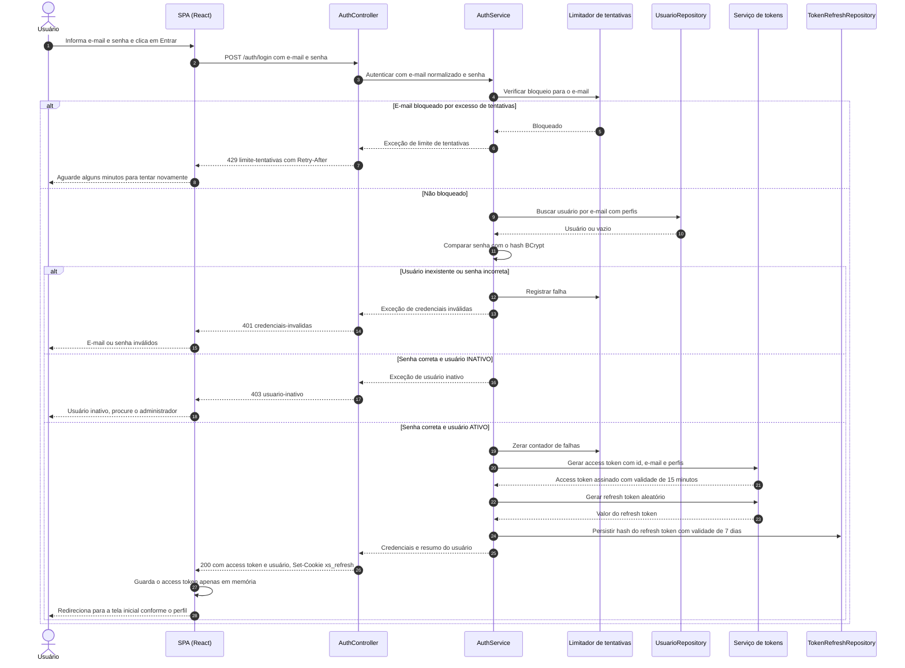

**Observações**
* Quando o usuário não existe, o sistema ainda executa uma comparação de hash fictícia, para que o tempo de resposta não revele se o e-mail está cadastrado.
* O access token nunca é gravado em armazenamento persistente do navegador (local ou de sessão), para reduzir o impacto de ataques de injeção de script.
* Ao recarregar a página, a SPA perde o access token e o recupera chamando o fluxo D3.

---

## 3. D2 - Validação de requisições protegidas

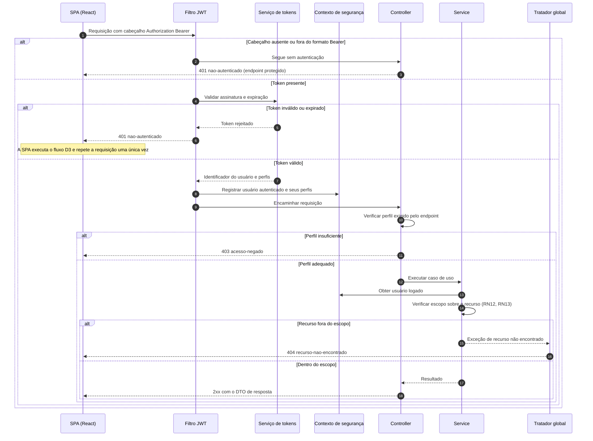

**Observações**
* O filtro **não consulta o banco** em cada requisição: confia nos perfis contidos no token. Por isso o access token tem vida curta (15 minutos): uma alteração de perfil ou inativação leva no máximo esse tempo para ter efeito completo, enquanto a renovação (D3) já é bloqueada imediatamente.
* A verificação de escopo é a defesa real contra IDOR; o UUID apenas dificulta a adivinhação.

---

## 4. D3 - Renovação de sessão com rotação e logout

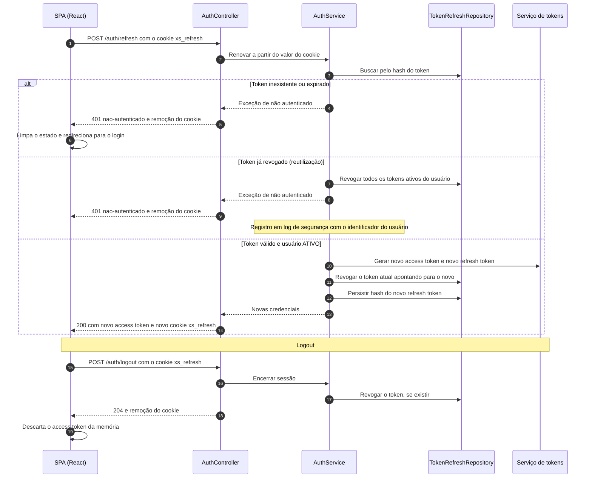

**Observações**
* Quando várias requisições recebem 401 ao mesmo tempo, a SPA deve executar **uma única** renovação e enfileirar as demais até a conclusão; caso contrário, renovações paralelas com o mesmo token disparariam a detecção de reutilização.
* Se o usuário tiver sido inativado, a renovação também é rejeitada com 401.

---

## 5. D4 - Recuperação de senha

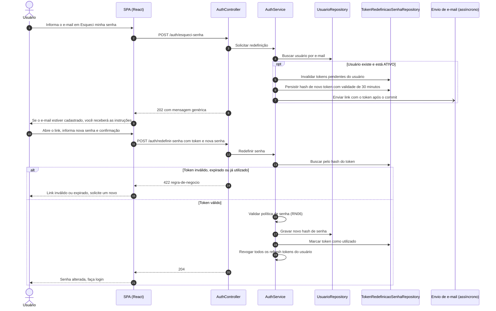

**Observação:** o tempo de resposta da solicitação deve ser equivalente com ou sem usuário encontrado; por isso o envio de e-mail é assíncrono.

---

## 6. D5 - Abertura de chamado

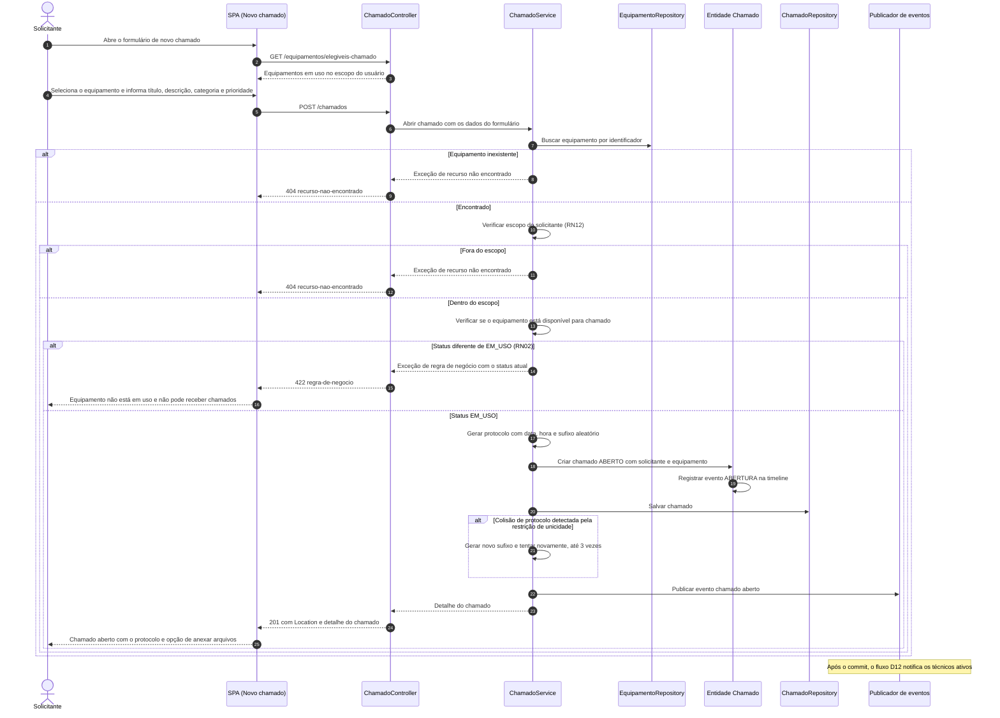

**Observação:** a nova tentativa após colisão de protocolo precisa ocorrer em uma nova transação (ou com verificação prévia de existência), porque uma violação de restrição invalida a transação corrente.

---

## 7. D6 - Designação, pendência e retomada

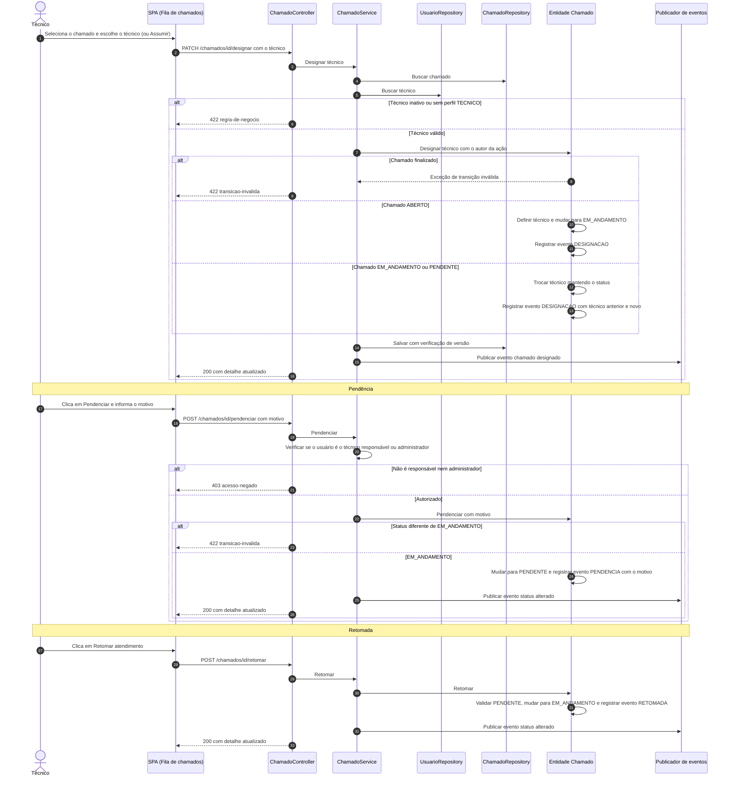

**Observação:** se dois técnicos tentarem assumir o mesmo chamado ao mesmo tempo, a verificação de versão garante que apenas o primeiro seja gravado; o segundo recebe 409 `conflito-concorrencia` e a SPA recarrega o chamado.

---

## 8. D7 - Conclusão com solução técnica

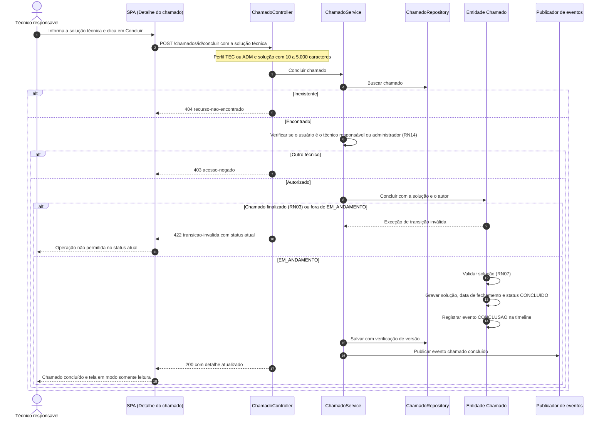

---

## 9. D8 - Cancelamento

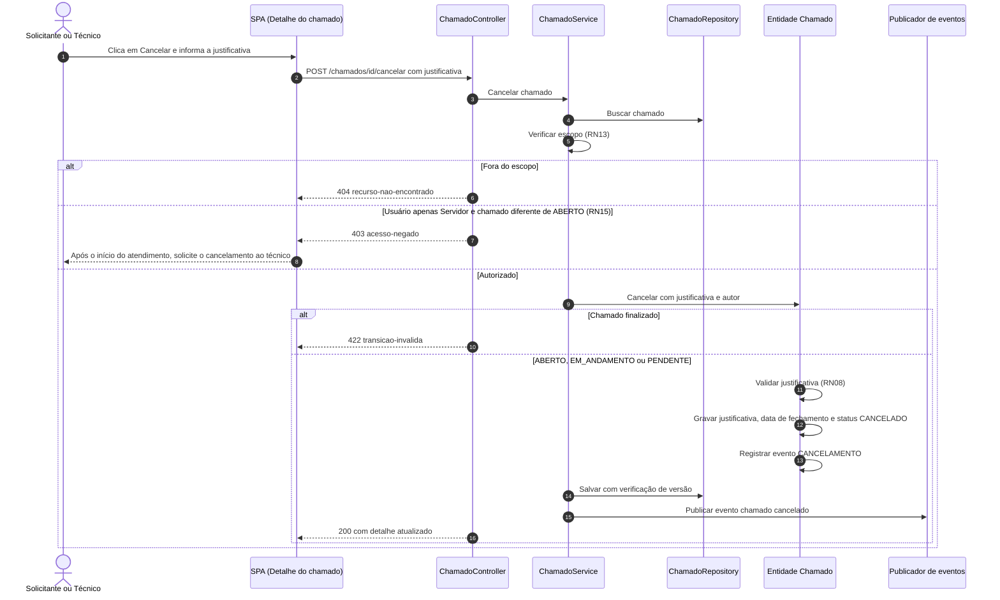

---

## 10. D9 - Interação na timeline

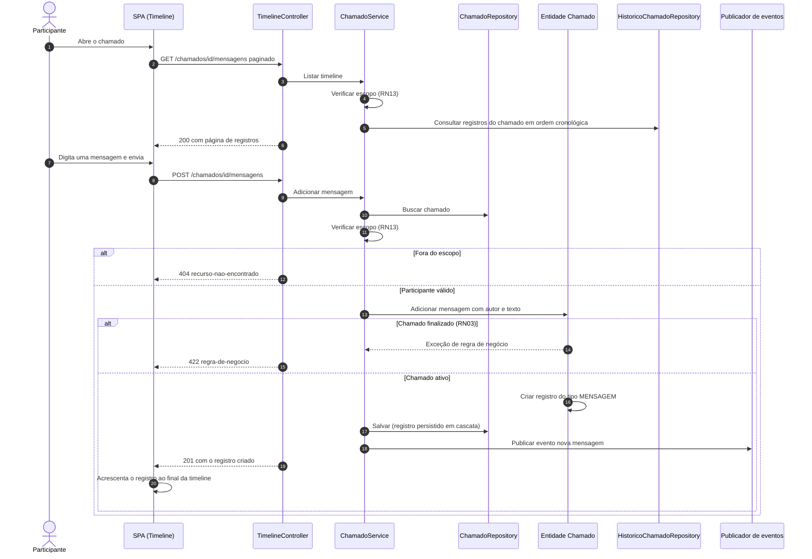

**Observação:** na Release 2.0 não há atualização em tempo real; a SPA recarrega a timeline ao abrir o chamado, após cada ação e quando o usuário acessa uma notificação relacionada (atualização por evento do servidor está no backlog, PB09).

---

## 11. D10 - Transferência de equipamento

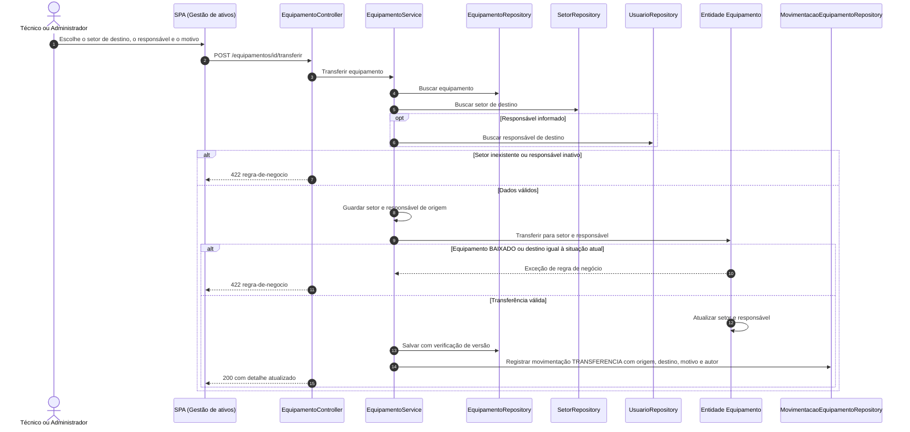

---

## 12. D11 - Baixa patrimonial com termo

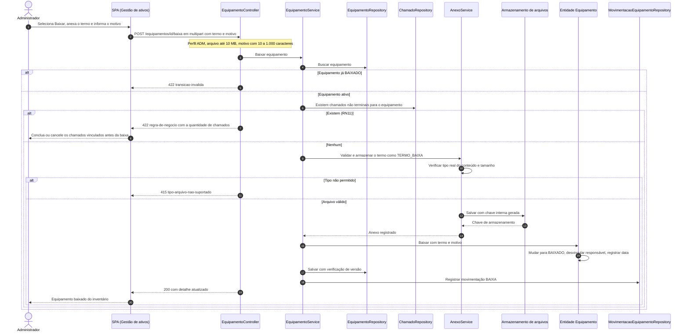

**Observação:** o arquivo é gravado no armazenamento antes do commit. Se a transação falhar depois disso, o arquivo fica órfão; a implementação deve removê-lo na reversão da transação ou uma rotina periódica deve limpar arquivos sem registro correspondente.

---

## 13. D12 - Notificação após o commit

Fluxo genérico disparado pelos eventos publicados em D5 a D9.

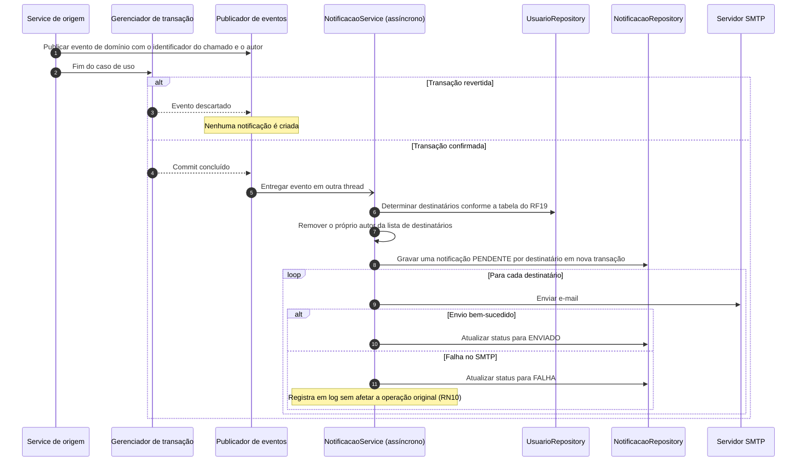

**Observações**
* O evento carrega apenas identificadores e dados simples, nunca entidades gerenciadas, porque o processamento ocorre fora da transação original.
* A notificação in-app (registro na tabela) é independente do e-mail: mesmo com falha de SMTP, o usuário vê a notificação no sistema.
* A SPA consulta periodicamente a contagem de não lidas (por exemplo, a cada 60 segundos) e ao trocar de tela.
