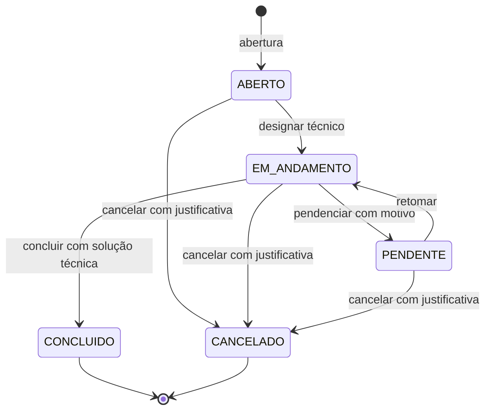
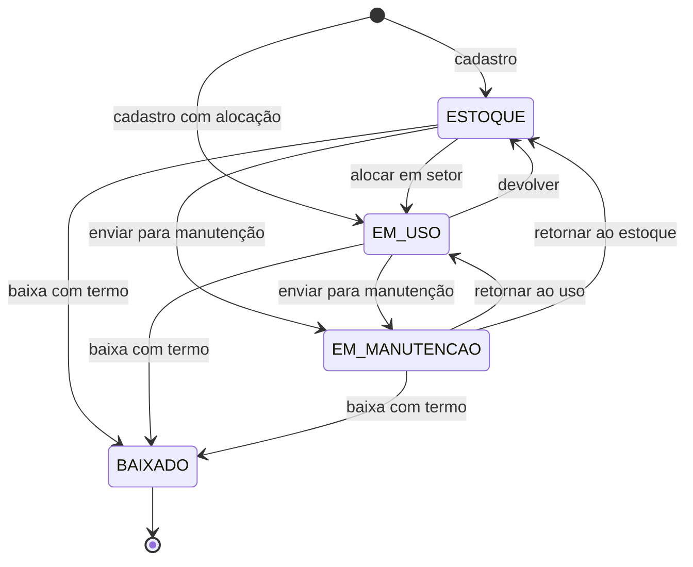

# Especificação de Requisitos de Software

* **Projeto:** X Solution - Sistema integrado de gestão de ativos de TI e Service Desk
* **Versão do documento:** 2.0
* **Autores:** Mateus Neri, Lucas Lima, Kaio França
* **Data:** Outubro de 2026

---

## 1. Introdução

### 1.1. Objetivo do documento
Este documento formaliza os requisitos funcionais, não funcionais e as regras de negócio do sistema **X Solution**. Ele é o contrato de entendimento entre produto e equipe de desenvolvimento: tudo o que for implementado deve ser rastreável a um item deste documento, e tudo o que estiver aqui deve ser verificável por um critério de aceite objetivo.

### 1.2. Escopo do sistema
O X Solution centraliza a governança operacional do departamento de Tecnologia da Informação de uma instituição em duas vertentes complementares:

1. **Gestão de ativos de TI (ITAM):** inventário de equipamentos, ciclo de vida operacional, alocação por setor e responsável, histórico de movimentações e baixa patrimonial com termo comprobatório.
2. **Service Desk (ITSM):** abertura de chamados vinculados obrigatoriamente a um ativo, classificação por categoria e prioridade, fila de atendimento, timeline colaborativa e auditável, encerramento com registro formal de solução técnica.

**Fora do escopo:** motor de SLA, pesquisa de satisfação, base de conhecimento, SSO corporativo, etiquetas QR Code e módulo financeiro.

### 1.3. Documentos relacionados
| Documento | Conteúdo |
| :--- | :--- |
| `contratos_api_rest.md` | Contrato detalhado de cada endpoint da API REST v1. |
| `diagrama_classes_arquitetura.md` | Arquitetura de camadas, modelo de domínio e modelo de dados alvo. |
| `diagramas_sequencia_web.md` | Colaboração temporal entre componentes nos fluxos críticos. |

### 1.4. Glossário
| Termo | Definição |
| :--- | :--- |
| **Ativo / Equipamento** | Item de hardware sob controle patrimonial, identificado por número de patrimônio. |
| **Número de patrimônio (tombamento)** | Código único atribuído pela instituição a cada ativo. |
| **Chamado / Ticket** | Solicitação de suporte técnico vinculada a um equipamento. |
| **Protocolo** | Código legível e único do chamado, exibido ao usuário para acompanhamento. |
| **Timeline** | Sequência cronológica e imutável de mensagens e eventos de um chamado. |
| **Solicitante** | Usuário que abriu o chamado. |
| **Técnico responsável** | Usuário com perfil Técnico designado para atender o chamado. |
| **Baixa patrimonial** | Retirada definitiva de um ativo do inventário operacional (descarte, doação, perda). |
| **Status terminal** | Status a partir do qual nenhuma transição é permitida. |
| **RBAC** | Controle de acesso baseado em perfis (*Role-Based Access Control*). |
| **Access token** | Credencial de curta duração enviada em cada requisição autenticada. |
| **Refresh token** | Credencial de longa duração usada exclusivamente para obter um novo access token. |
| **IDOR** | Vulnerabilidade de acesso a recursos de terceiros pela manipulação de identificadores na URL. |

---

## 2. Descrição geral

### 2.1. Perspectiva do produto
O X Solution substitui uma aplicação desktop legada (interfaces locais acessando o banco diretamente) por uma arquitetura cliente-servidor desacoplada:

* **Backend:** API REST stateless em Java 21 com Spring Boot 4.
* **Frontend:** aplicação de página única (SPA) em React 19 com TypeScript.
* **Banco de dados:** PostgreSQL, com estrutura versionada exclusivamente por migrations do Flyway.

### 2.2. Premissas
* Todo usuário pertence a exatamente um setor.
* Todo chamado é obrigatoriamente vinculado a um equipamento cadastrado.
* A instituição dispõe de um servidor SMTP para o envio de e-mails.
* O primeiro usuário Administrador é criado por carga inicial controlada (migration de dados ou rotina de implantação), nunca pelo auto-cadastro.

### 2.3. Restrições
* A comunicação entre frontend e backend usa exclusivamente JSON sobre HTTPS (exceto upload e download de arquivos).
* Nenhuma alteração estrutural de banco pode ser feita fora do Flyway.
* Não há exclusão física de usuários, equipamentos ou chamados: a preservação histórica é obrigatória.

---

## 3. Atores e perfis de acesso (RBAC)

### 3.1. Perfis
O controle de acesso adota RBAC **por composição**: um usuário possui um conjunto de um ou mais perfis, e suas permissões são a **união** das permissões de cada perfil. **Não existe hierarquia implícita** entre perfis: cada operação declara explicitamente quais perfis a executam.

| Perfil | Identificador interno | Responsabilidades |
| :--- | :--- | :--- |
| **Administrador** | `ADMINISTRADOR` | Gestão de usuários, perfis e setores. Supervisão total de chamados e equipamentos. Baixa patrimonial, relatórios e anonimização (LGPD). |
| **Técnico de suporte** | `TECNICO` | Atendimento da fila de chamados, designação, classificação, diagnóstico na timeline, conclusão. Cadastro, movimentação e manutenção de equipamentos. |
| **Servidor** | `SERVIDOR` | Usuário final: abertura e acompanhamento dos próprios chamados, interação na timeline dos próprios chamados, gestão do próprio perfil. |

> Na autoridade de segurança do framework, os perfis são expostos com o prefixo `ROLE_` (ex.: `ROLE_TECNICO`). No banco e nos contratos da API, o valor é armazenado e trafegado **sem** o prefixo.

### 3.2. Ator não autenticado
Visitante sem sessão. Pode apenas: autenticar-se, solicitar auto-cadastro, solicitar e efetivar a recuperação de senha e consultar a lista pública de setores (necessária ao formulário de cadastro).

### 3.3. Matriz de permissões

Legenda: **✔** permitido · **P** permitido apenas sobre recursos próprios ou relacionados (ver regra indicada) · **—** negado.

| Operação | Servidor | Técnico | Administrador |
| :--- | :---: | :---: | :---: |
| Visualizar e editar o próprio perfil, alterar a própria senha | ✔ | ✔ | ✔ |
| Listar, criar e editar usuários, alterar perfis e status | - | - | ✔ |
| Listar técnicos ativos (para designação) | - | ✔ | ✔ |
| Anonimizar usuário (LGPD) | - | - | ✔ |
| Listar setores | ✔ | ✔ | ✔ |
| Criar, editar e remover setores | - | - | ✔ |
| Consultar equipamento | P (RN12) | ✔ | ✔ |
| Cadastrar e editar equipamento, alterar status, transferir | - | ✔ | ✔ |
| Realizar baixa patrimonial | - | - | ✔ |
| Abrir chamado | P (RN12) | ✔ | ✔ |
| Consultar chamado e timeline | P (RN13) | ✔ | ✔ |
| Listar a fila geral de chamados | - | ✔ | ✔ |
| Enviar mensagem e anexos na timeline | P (RN13) | ✔ | ✔ |
| Designar técnico, reclassificar, pendenciar e retomar | - | ✔ | ✔ |
| Concluir chamado | - | P (RN14) | ✔ |
| Cancelar chamado | P (RN15) | ✔ | ✔ |
| Visualizar o dashboard operacional | - | ✔ | ✔ |
| Exportar relatórios | - | - | ✔ |

---

## 4. Requisitos funcionais (RF)

**Prioridade (MoSCoW):** **M** = obrigatório na release · **S** = importante · **C** = desejável.

### 4.1. Módulo de identidade, autenticação e acesso

#### [RF01] Autenticação e sessão stateless
* **Descrição:** autenticar o usuário por e-mail e senha e emitir um par de credenciais: um access token JWT de curta duração e um refresh token de longa duração.
* **Atores:** qualquer usuário cadastrado.
* **Pré-condições:** usuário cadastrado.
* **Fluxo principal:**
  1. O usuário informa e-mail e senha.
  2. O sistema normaliza o e-mail (remove espaços e converte para minúsculas).
  3. O sistema localiza o usuário e compara a senha informada com o hash armazenado.
  4. O sistema verifica se o usuário está com status `ATIVO`.
  5. O sistema emite o access token (validade de **15 minutos**) e o refresh token (validade de **7 dias**).
  6. O sistema retorna o access token e o resumo do usuário no corpo da resposta. O refresh token é entregue em um cookie seguro, inacessível ao JavaScript.
* **Fluxos de exceção:**
  * E-mail inexistente ou senha incorreta: rejeição com mensagem genérica "E-mail ou senha inválidos" (HTTP 401), sem revelar qual dos dois está errado.
  * Credenciais corretas, mas usuário `INATIVO`: rejeição com HTTP 403 e mensagem "Usuário inativo. Procure o administrador do sistema."
  * Excesso de tentativas: rejeição temporária (RN16), com HTTP 429.
* **Critérios de aceite:**
  * O access token contém: identificador do usuário (UUID), e-mail, perfis, data de emissão e data de expiração.
  * O access token não contém dados sensíveis (senha, hash, dados pessoais além do e-mail).
  * O tempo de resposta para credenciais inexistentes e para credenciais com senha errada é equivalente (mitigação de enumeração por tempo).
* **Regras relacionadas:** RN06, RN16.

#### [RF02] Renovação e encerramento de sessão
* **Descrição:** permitir obter um novo access token a partir de um refresh token válido e permitir o encerramento explícito da sessão (logout).
* **Atores:** qualquer usuário autenticado.
* **Fluxo principal (renovação):**
  1. O frontend detecta que o access token expirou (resposta 401) ou está prestes a expirar.
  2. O frontend solicita a renovação; o navegador envia automaticamente o cookie do refresh token.
  3. O sistema valida o refresh token: existe, não está revogado, não expirou e pertence a um usuário `ATIVO`.
  4. O sistema **revoga** o refresh token usado e emite um novo par de credenciais (rotação).
* **Fluxo principal (logout):** o sistema revoga o refresh token atual e instrui o navegador a remover o cookie.
* **Fluxos de exceção:**
  * Refresh token inválido, expirado ou revogado: HTTP 401. O frontend redireciona para o login.
  * **Reutilização de refresh token já revogado** (indício de roubo): o sistema revoga **todos** os refresh tokens ativos do usuário e responde HTTP 401.
* **Critérios de aceite:**
  * Refresh tokens são persistidos apenas como hash, nunca em texto puro.
  * A inativação de um usuário revoga todos os seus refresh tokens.

#### [RF03] Auto-cadastro de servidores
* **Descrição:** permitir que um novo servidor crie sua conta.
* **Atores:** ator não autenticado.
* **Fluxo principal:**
  1. O visitante acessa o formulário de cadastro, que lista os setores disponíveis.
  2. Informa nome completo, e-mail institucional, senha, confirmação de senha e setor.
  3. O sistema valida os campos, a política de senha (RN06) e a unicidade do e-mail.
  4. O sistema cria a conta com status `ATIVO` e com perfil único `SERVIDOR`.
* **Fluxos de exceção:**
  * E-mail já cadastrado: HTTP 409.
  * Setor inexistente: HTTP 422.
  * Senha fora da política ou confirmação divergente: HTTP 400 com a indicação dos campos inválidos.
* **Critérios de aceite:**
  * Não é possível escolher outro perfil pelo auto-cadastro, mesmo que o cliente envie esse dado (o campo é ignorado).
  * A conta criada não autentica automaticamente: o usuário segue para o login.
* **Observação:** a ativação por confirmação de e-mail fica no backlog (PB07).

#### [RF04] Recuperação de senha
* **Descrição:** permitir redefinir a senha por meio de um link com token temporário enviado por e-mail.
* **Atores:** ator não autenticado.
* **Fluxo principal:**
  1. O usuário informa seu e-mail.
  2. Se o e-mail pertencer a um usuário `ATIVO`, o sistema gera um token aleatório de uso único, válido por **30 minutos**, persiste apenas o seu hash e envia por e-mail um link contendo o token.
  3. O usuário acessa o link, informa a nova senha e a confirmação.
  4. O sistema valida o token (existe, não expirou, não foi usado), aplica a nova senha, marca o token como utilizado e revoga todos os refresh tokens do usuário.
* **Fluxos de exceção:**
  * Token inválido, expirado ou já utilizado: HTTP 422 com orientação para solicitar um novo link.
* **Critérios de aceite:**
  * A solicitação **sempre** retorna a mesma resposta genérica de sucesso, exista o e-mail ou não (proteção contra enumeração).
  * Uma nova solicitação invalida tokens anteriores ainda pendentes do mesmo usuário.
  * A nova senha cumpre a RN06.

#### [RF05] Gestão do próprio perfil
* **Descrição:** o usuário autenticado visualiza seus dados, altera o próprio nome e a própria senha.
* **Atores:** qualquer usuário autenticado.
* **Critérios de aceite:**
  * Os dados exibidos são: nome, e-mail, setor, perfis, status e data de cadastro.
  * E-mail, setor, perfis e status **não** são alteráveis pelo próprio usuário (apenas pelo Administrador).
  * A alteração de senha exige a senha atual correta (HTTP 422 se incorreta), a nova senha conforme a RN06 e a confirmação idêntica.
  * A nova senha deve ser diferente da senha atual.
  * Após a alteração de senha, todos os refresh tokens do usuário são revogados, exceto o da sessão corrente.

#### [RF06] Gestão administrativa de usuários
* **Descrição:** o Administrador lista, consulta, cadastra e edita usuários, define seus perfis e altera seu status.
* **Atores:** Administrador.
* **Funcionalidades:**
  * Listagem paginada com filtros combináveis: nome (busca parcial, sem distinção de maiúsculas e acentos), e-mail, perfil, status e setor.
  * Cadastro de usuário com perfis definidos pelo Administrador (inclusive Técnico e Administrador). A senha inicial é gerada pelo sistema e enviada por e-mail, com troca obrigatória no primeiro acesso (C - se não implementado na release, o Administrador informa a senha inicial respeitando a RN06).
  * Edição de nome e setor.
  * Alteração do conjunto de perfis (substituição integral do conjunto).
  * Ativação e inativação.
  * Listagem simplificada de técnicos ativos, usada no componente de designação de chamados (disponível também ao Técnico).
* **Critérios de aceite:**
  * Todo usuário mantém ao menos um perfil (HTTP 400 se o conjunto vier vazio).
  * Não é possível inativar, nem remover o perfil Administrador, do **último administrador ativo** (RN05) - HTTP 422.
  * O Administrador não pode inativar a si mesmo.
  * A inativação revoga as sessões do usuário (RF02).
  * Usuário inativo continua aparecendo como autor e solicitante em registros históricos.
  * Não existe exclusão física de usuários.

#### [RF07] Anonimização de dados pessoais (LGPD)
* **Descrição:** atender solicitação formal de eliminação de dados pessoais sem destruir o histórico operacional.
* **Atores:** Administrador.
* **Fluxo principal:**
  1. O Administrador seleciona o usuário e confirma a anonimização, informando o número do protocolo da solicitação do titular.
  2. O sistema substitui o nome por "Usuário anonimizado", substitui o e-mail por um valor único e não identificável, invalida a senha, remove todos os perfis exceto `SERVIDOR`, inativa o usuário e revoga suas sessões.
  3. O sistema registra a operação em log de auditoria (quem, quando e o protocolo da solicitação).
* **Critérios de aceite:**
  * A operação é irreversível e exige confirmação explícita.
  * Chamados, timeline e movimentações permanecem íntegros, exibindo o autor como "Usuário anonimizado".
  * A regra do último administrador (RN05) também se aplica.

---

### 4.2. Módulo de gestão patrimonial

#### [RF08] Gestão de setores
* **Descrição:** manter o cadastro de setores organizacionais (nome e sigla).
* **Atores:** Administrador (escrita) · qualquer pessoa (leitura).
* **Critérios de aceite:**
  * Nome único, sem distinção de maiúsculas (HTTP 409). Sigla única, armazenada em maiúsculas (HTTP 409).
  * Nome com até 100 caracteres. Sigla com 2 a 20 caracteres.
  * A remoção é bloqueada se houver usuários ou equipamentos vinculados ao setor (HTTP 409, com mensagem informando a quantidade de vínculos).
  * A listagem pública retorna apenas identificador, nome e sigla, em ordem alfabética.

#### [RF09] Inventário de equipamentos
* **Descrição:** cadastrar, editar, consultar e filtrar ativos de TI.
* **Atores:** Administrador, Técnico.
* **Dados do equipamento:** número de patrimônio, número de série, marca, modelo, tipo, status, data de aquisição (opcional), setor de alocação e usuário responsável (opcional).
* **Tipos de equipamento:** `COMPUTADOR`, `NOTEBOOK`, `MONITOR`, `IMPRESSORA`, `NOBREAK`, `ESTABILIZADOR`, `OUTRO`.
* **Critérios de aceite:**
  * Número de patrimônio único, normalizado em maiúsculas e sem espaços nas extremidades (HTTP 409 em duplicidade).
  * No cadastro, o status inicial só pode ser `ESTOQUE` ou `EM_USO` (HTTP 422 para outros valores).
  * Se o status for `EM_USO`, o setor é obrigatório e o responsável é opcional (equipamentos de uso coletivo, como impressoras).
  * O responsável, quando informado, deve ser um usuário `ATIVO`.
  * A data de aquisição não pode ser futura.
  * A edição cadastral altera apenas: número de série, marca, modelo, tipo e data de aquisição. Status, setor e responsável mudam somente pelos fluxos de RF10 e RF11. O número de patrimônio é imutável após o cadastro.
  * O identificador do equipamento é um UUID versão 7, gerado pela aplicação.
  * A listagem é paginada, com filtros combináveis: número de patrimônio (parcial), número de série (parcial), marca, tipo, status, setor e responsável. Por padrão, equipamentos `BAIXADO` não aparecem, exceto quando o filtro de status os solicita explicitamente.

#### [RF10] Ciclo de vida e baixa patrimonial
* **Descrição:** controlar as transições de status do equipamento conforme a máquina de estados da seção 6.2.
* **Atores:** Administrador e Técnico (baixa exclusiva do Administrador).
* **Critérios de aceite:**
  * Somente as transições previstas na seção 6.2 são aceitas. Qualquer outra resulta em HTTP 422, informando o status atual e os destinos permitidos.
  * Ao retornar para `ESTOQUE`, o responsável é desvinculado automaticamente.
  * A baixa exige: anexo do **termo de baixa/descarte** (PDF, PNG ou JPG) e motivo textual de no mínimo 10 caracteres (RN04).
  * A baixa é bloqueada se houver chamados não terminais vinculados ao equipamento (RN11).
  * `BAIXADO` é terminal: o equipamento não pode ser editado, transferido nem receber chamados.
  * Toda mudança de status gera um registro de movimentação (RF11), com status anterior, status novo, autor, data e motivo.

#### [RF11] Movimentação, transferência e histórico do ativo
* **Descrição:** transferir um equipamento entre setores e/ou alterar seu responsável, mantendo um histórico completo e imutável das movimentações.
* **Atores:** Administrador, Técnico.
* **Critérios de aceite:**
  * Na transferência, o setor de destino é obrigatório. O responsável de destino é opcional e, se informado, deve ser `ATIVO`.
  * A transferência para o mesmo setor e o mesmo responsável é rejeitada (HTTP 422).
  * Equipamento `BAIXADO` não pode ser transferido (HTTP 422).
  * Cada movimentação registra: tipo (cadastro, transferência, mudança de status, baixa), setor de origem e de destino, responsável de origem e de destino, status anterior e novo, motivo, autor e data/hora.
  * O histórico é consultável por equipamento, em ordem cronológica decrescente, e não admite edição nem exclusão.
  * A consulta do equipamento exibe também a lista dos chamados vinculados a ele.

---

### 4.3. Módulo de Service Desk

#### [RF12] Abertura de chamado vinculada a ativo
* **Descrição:** registrar uma solicitação de suporte técnico vinculada a um equipamento.
* **Atores:** qualquer usuário autenticado.
* **Fluxo principal:**
  1. O usuário seleciona o equipamento (lista de equipamentos elegíveis ou busca por número de patrimônio).
  2. Informa título, descrição, categoria e prioridade sugerida.
  3. O sistema valida a elegibilidade do equipamento (RN02) e o escopo do solicitante (RN12).
  4. O sistema gera o protocolo, define o status `ABERTO`, registra o evento de abertura na timeline e persiste o chamado.
  5. Após a confirmação da transação, o sistema notifica os técnicos (RF19).
  6. O usuário pode, em seguida, anexar arquivos ao chamado (RF17).
* **Categorias:** `HARDWARE`, `SOFTWARE`, `REDE`, `ACESSO`, `OUTRO`.
* **Prioridades:** `BAIXA`, `MEDIA`, `ALTA`, `CRITICA`. Se não informada, assume `MEDIA`.
* **Fluxos de exceção:**
  * Equipamento inexistente: HTTP 404.
  * Equipamento fora do escopo do solicitante (RN12): HTTP 404 (o sistema não revela a existência do recurso).
  * Equipamento com status diferente de `EM_USO`: HTTP 422, informando o status atual.
* **Critérios de aceite:**
  * Título com 5 a 255 caracteres. Descrição com no mínimo 10 caracteres e no máximo 5.000.
  * Protocolo no formato `AAAAMMDD-HHMMSS-XXX`: data e hora da abertura no fuso da instituição, seguidas de 3 caracteres alfanuméricos maiúsculos aleatórios. A unicidade é garantida por restrição no banco; em caso de colisão, o sistema gera um novo sufixo (até 3 tentativas).
  * O solicitante é sempre o usuário autenticado: o cliente não pode informar outro solicitante.
  * Status inicial `ABERTO`, sem técnico responsável.

#### [RF13] Fila de chamados e designação
* **Descrição:** painel de atendimento para listar, buscar e filtrar chamados e designar o técnico responsável.
* **Atores:** Administrador, Técnico.
* **Filtros combináveis:** status (múltiplos), prioridade, categoria, solicitante, técnico responsável, "atribuídos a mim", "sem técnico", setor do equipamento, protocolo, texto livre (título e descrição) e período de abertura.
* **Ordenação padrão:** prioridade (da `CRITICA` para a `BAIXA`) e, em seguida, data de abertura (mais antigos primeiro).
* **Critérios de aceite:**
  * O técnico designado deve estar `ATIVO` e possuir o perfil `TECNICO` (HTTP 422 caso contrário).
  * Ao designar um técnico em chamado `ABERTO`, o status muda automaticamente para `EM_ANDAMENTO`.
  * É permitido redesignar o técnico em chamados `EM_ANDAMENTO` ou `PENDENTE`, sem alterar o status.
  * Um Técnico pode designar a si mesmo ("assumir chamado").
  * Toda designação gera um evento na timeline e uma notificação para o técnico designado e para o solicitante.
  * Não é possível designar técnico em chamado com status terminal (HTTP 422).

#### [RF14] Classificação, pendência e retomada
* **Descrição:** permitir ao atendimento reclassificar o chamado e controlar pausas no atendimento.
* **Atores:** Administrador, Técnico.
* **Critérios de aceite:**
  * Categoria e prioridade podem ser alteradas em qualquer status não terminal. Cada alteração gera um evento na timeline com o valor anterior e o novo.
  * **Pendenciar:** `EM_ANDAMENTO` → `PENDENTE`, com motivo obrigatório de no mínimo 10 caracteres (ex.: aguardando peça, aguardando retorno do usuário). O motivo é registrado na timeline.
  * **Retomar:** `PENDENTE` → `EM_ANDAMENTO`, gerando um evento na timeline.
  * Somente o técnico responsável ou um Administrador pode pendenciar ou retomar (HTTP 403 para outros técnicos).

#### [RF15] Timeline de atendimento
* **Descrição:** cada chamado possui uma timeline cronológica, colaborativa e imutável, composta por **mensagens** (escritas por pessoas) e **eventos de sistema** (abertura, designação, mudança de status, reclassificação, pendência, conclusão, cancelamento, anexos).
* **Atores:** solicitante do chamado, técnicos e administradores.
* **Critérios de aceite:**
  * Mensagem com 2 a 5.000 caracteres.
  * Não há edição nem exclusão de registros da timeline.
  * Não é possível enviar mensagens em chamados com status terminal (HTTP 422).
  * O Servidor só lê e escreve na timeline dos chamados que ele próprio abriu (RN13).
  * Cada registro exibe: tipo (mensagem ou evento), autor, data/hora e conteúdo.
  * Uma nova mensagem notifica a outra parte: se o autor é o solicitante, notifica o técnico responsável; se o autor é da equipe técnica, notifica o solicitante.

#### [RF16] Conclusão com solução técnica
* **Descrição:** encerrar o chamado com o registro formal da ação corretiva realizada.
* **Atores:** técnico responsável pelo chamado, Administrador.
* **Critérios de aceite:**
  * Só é permitida a partir do status `EM_ANDAMENTO` (HTTP 422 a partir de `ABERTO`, `PENDENTE` ou de status terminal).
  * Solução técnica obrigatória, com 10 a 5.000 caracteres (RN07).
  * A data de fechamento é preenchida automaticamente pelo servidor.
  * A solução é registrada no chamado e também como evento na timeline.
  * Após a conclusão, o chamado se torna imutável (RN03).
  * O solicitante é notificado.

#### [RF17] Anexos de chamado
* **Descrição:** permitir anexar arquivos (fotos do defeito, prints de erro, laudos) a um chamado.
* **Atores:** participantes do chamado (RN13).
* **Critérios de aceite:**
  * Tipos aceitos: PDF, PNG, JPG/JPEG. Tamanho máximo de **10 MB** por arquivo e até **10 anexos** por chamado.
  * O tipo é validado pelo conteúdo real do arquivo, não apenas pela extensão informada.
  * O arquivo é armazenado fora do banco de dados (sistema de arquivos ou armazenamento de objetos), com um nome interno gerado pelo sistema. O banco guarda apenas os metadados: nome original, tipo, tamanho, autor, data e chave de armazenamento.
  * Não é permitido anexar em chamados com status terminal.
  * O download exige autenticação e a mesma regra de acesso do chamado.
  * Cada anexo gera um evento na timeline.

#### [RF18] Cancelamento com justificativa
* **Descrição:** cancelar um chamado antes de sua conclusão.
* **Atores:**
  * Solicitante: apenas enquanto o status for `ABERTO` (RN15).
  * Técnico e Administrador: em `ABERTO`, `EM_ANDAMENTO` ou `PENDENTE`.
* **Critérios de aceite:**
  * Justificativa obrigatória, com 10 a 2.000 caracteres (RN08).
  * A justificativa é registrada no chamado e como evento na timeline.
  * A data de fechamento é preenchida automaticamente.
  * `CANCELADO` é terminal.
  * As partes envolvidas (solicitante e técnico responsável, se houver), exceto o autor do cancelamento, são notificadas.

---

### 4.4. Módulo de notificações, dashboard e relatórios

#### [RF19] Central de notificações
* **Descrição:** gerar notificações internas (in-app) e por e-mail nos eventos relevantes.
* **Eventos e destinatários:**

| Evento | Destinatários |
| :--- | :--- |
| Chamado aberto | Todos os técnicos ativos |
| Técnico designado ou redesignado | Técnico designado e solicitante |
| Mudança de status (pendência, retomada) | Solicitante |
| Nova mensagem na timeline | A outra parte (ver RF15) |
| Chamado concluído | Solicitante |
| Chamado cancelado | Partes envolvidas, exceto o autor |

* **Critérios de aceite:**
  * As notificações são geradas **somente após a confirmação** (commit) da transação que originou o evento. Uma operação desfeita não gera notificação.
  * O envio de e-mail ocorre de forma assíncrona e nunca desfaz a operação principal (RN10).
  * Cada notificação registra o status de envio: `PENDENTE`, `ENVIADO` ou `FALHA`.
  * O usuário visualiza suas notificações em ordem decrescente de data, consulta o total de não lidas, marca uma notificação como lida ou todas de uma vez.
  * Cada notificação contém uma referência ao chamado relacionado, permitindo a navegação direta.
  * O usuário nunca acessa notificações de outro usuário (HTTP 404).

#### [RF20] Dashboard operacional
* **Descrição:** exibir indicadores na tela inicial da equipe técnica.
* **Atores:** Administrador, Técnico.
* **Indicadores:** chamados abertos, em andamento, pendentes, concluídos no mês corrente; chamados atribuídos ao usuário logado; equipamentos em uso e em manutenção; distribuição de chamados não terminais por setor e por prioridade.
* **Critérios de aceite:**
  * Os valores refletem o estado do banco no momento da consulta (sem atraso superior a 1 minuto, caso seja adotado cache).
  * O "mês corrente" é calculado no fuso horário da instituição.

#### [RF21] Relatórios gerenciais
* **Descrição:** exportar relatórios tabulares em CSV e PDF.
* **Atores:** Administrador.
* **Relatórios:**
  * **Chamados:** período de abertura obrigatório (RN09), com filtros opcionais de status, categoria, prioridade, setor e técnico. Colunas: protocolo, título, status, categoria, prioridade, solicitante, setor, equipamento, técnico, data de abertura, data de fechamento, tempo total de atendimento.
  * **Inventário de equipamentos:** retrato atual, com filtros opcionais de status, tipo e setor. Colunas: patrimônio, série, tipo, marca, modelo, status, setor, responsável, data de aquisição.
* **Critérios de aceite:**
  * O arquivo é gerado com o nome no padrão `relatorio-<tipo>-<data-hora>.<extensão>`.
  * O CSV usa codificação UTF-8 com BOM e ponto e vírgula como separador (compatibilidade com planilhas em português).
  * Um período superior a 365 dias ou com data final anterior à inicial é rejeitado (HTTP 422).

---

## 5. Requisitos não funcionais (RNF)

| ID | Categoria | Especificação | Critério de verificação |
| :--- | :--- | :--- | :--- |
| **RNF01** | Arquitetura | API REST stateless em Spring Boot 4 / Java 21 e SPA em React 19 / TypeScript / Vite, comunicando-se via JSON. Backend organizado em camadas (ver documento de arquitetura). | Revisão de código. Nenhuma sessão HTTP é criada no servidor. |
| **RNF02** | Padronização de erros | Toda resposta de erro segue o formato *Problem Details* (RFC 9457, sucessora da RFC 7807), com tratamento centralizado de exceções. | Testes de integração verificam o formato em respostas 4xx e 5xx. |
| **RNF03** | Segurança de transporte e credenciais | HTTPS obrigatório fora do ambiente local. Senhas com hash BCrypt de custo 12. Access token JWT assinado, com segredo de no mínimo 256 bits fornecido por variável de ambiente. Refresh token em cookie `HttpOnly`, `Secure` e `SameSite=Strict`. | Inspeção de configuração e testes de segurança. |
| **RNF04** | CORS | Apenas as origens do frontend configuradas por ambiente são permitidas. Uso de curinga é proibido. | Teste de requisição a partir de origem não autorizada. |
| **RNF05** | Proteção contra IDOR | Recursos de negócio usam UUIDv7 como identificador público. **Além disso**, toda leitura e escrita verifica se o usuário tem direito sobre aquele recurso específico (RN12, RN13). Um UUID não é um mecanismo de autorização. | Testes automatizados de acesso cruzado entre usuários. |
| **RNF06** | Desempenho | Endpoints de leitura com P95 inferior a 250 ms e de escrita inferior a 500 ms, com base de 100 mil chamados e 20 mil equipamentos. Pool de conexões HikariCP. Listagens sempre paginadas, com no máximo 100 itens por página. Sem consultas N+1 nas listagens. | Teste de carga e análise do log de SQL. |
| **RNF07** | Versionamento de schema | 100% da estrutura do banco é gerida por migrations Flyway versionadas e imutáveis depois de aplicadas em ambiente compartilhado. O Hibernate apenas valida o mapeamento e nunca altera o schema. | A aplicação sobe do zero em banco vazio. A validação do mapeamento passa na inicialização. |
| **RNF08** | Concorrência | Chamados e equipamentos usam controle de concorrência otimista (coluna de versão). A edição simultânea do mesmo registro resulta em HTTP 409 para a segunda gravação. | Teste de integração com duas atualizações concorrentes. |
| **RNF09** | Datas e fuso horário | Instantes persistidos com fuso horário e trafegados em ISO-8601 UTC. A conversão para exibição é feita no frontend. Datas sem horário (aquisição) são trafegadas no formato ano-mês-dia. | Revisão dos contratos e testes. |
| **RNF10** | Conformidade LGPD | Minimização de dados nos tokens e logs (senhas, tokens e hashes nunca aparecem em log). Anonimização sob solicitação (RF07). Logs de auditoria retidos por 5 anos. | Revisão de logs e teste do RF07. |
| **RNF11** | Observabilidade | Logs estruturados com identificador de correlação por requisição, propagado nas respostas de erro. Endpoints de saúde (*health check*) expostos para a infraestrutura. | Inspeção de logs em homologação. |
| **RNF12** | Documentação da API | Especificação OpenAPI gerada automaticamente e interface de exploração disponível nos ambientes de desenvolvimento e homologação (desabilitada em produção). | Acesso à documentação gerada. |
| **RNF13** | Qualidade e testes | Testes unitários das regras de domínio. Testes de integração da API contra PostgreSQL real em contêiner. Cobertura mínima de 70% nas camadas de domínio e serviço. Pipeline de CI executa build e testes a cada *pull request*. | Relatório de cobertura e status do pipeline. |
| **RNF14** | Usabilidade e acessibilidade | Interface responsiva (a partir de 360 px de largura) e aderente às diretrizes WCAG 2.1 nível AA nas telas principais. Mensagens de erro em português claro, sem jargão técnico. | Revisão de UX e ferramenta automatizada de acessibilidade. |
| **RNF15** | Configuração por ambiente | Credenciais, segredos e URLs são externalizados por variáveis de ambiente, nunca versionados. Perfis de configuração distintos para desenvolvimento, teste e produção. | Revisão do repositório: nenhum segredo versionado. |

---

## 6. Máquinas de estado

### 6.1. Chamado

| Origem | Destino | Ação | Quem pode | Exigência |
| :--- | :--- | :--- | :--- | :--- |
| - | `ABERTO` | Abrir | Qualquer autenticado | Equipamento `EM_USO` (RN02) e no escopo (RN12) |
| `ABERTO` | `EM_ANDAMENTO` | Designar técnico | Técnico, Administrador | Técnico ativo com perfil `TECNICO` |
| `EM_ANDAMENTO` | `PENDENTE` | Pendenciar | Técnico responsável, Administrador | Motivo com no mínimo 10 caracteres |
| `PENDENTE` | `EM_ANDAMENTO` | Retomar | Técnico responsável, Administrador | - |
| `EM_ANDAMENTO` | `CONCLUIDO` | Concluir | Técnico responsável, Administrador | Solução técnica (RN07) |
| `ABERTO` | `CANCELADO` | Cancelar | Solicitante, Técnico, Administrador | Justificativa (RN08) |
| `EM_ANDAMENTO`, `PENDENTE` | `CANCELADO` | Cancelar | Técnico, Administrador | Justificativa (RN08) |

Qualquer combinação não listada é inválida e resulta em HTTP 422.

### 6.2. Equipamento

| Origem | Destino | Quem pode | Exigência |
| :--- | :--- | :--- | :--- |
| `ESTOQUE`, `EM_MANUTENCAO` | `EM_USO` | Técnico, Administrador | Setor definido. Responsável opcional. |
| `EM_USO`, `EM_MANUTENCAO` | `ESTOQUE` | Técnico, Administrador | O responsável é desvinculado. |
| `ESTOQUE`, `EM_USO` | `EM_MANUTENCAO` | Técnico, Administrador | Motivo opcional. |
| `ESTOQUE`, `EM_USO`, `EM_MANUTENCAO` | `BAIXADO` | Administrador | Termo anexado, motivo (RN04) e nenhum chamado não terminal (RN11). |

---

## 7. Regras de negócio (RN)

| ID | Nome | Descrição |
| :--- | :--- | :--- |
| **RN01** | Composição de perfis | Um usuário pode acumular múltiplos perfis. Suas permissões são a união das permissões de cada perfil. Não há herança implícita entre perfis. Todo usuário possui ao menos um perfil. A autorização é verificada no backend em cada operação; o frontend apenas oculta elementos de interface, sem garantir segurança. |
| **RN02** | Elegibilidade do ativo para chamado | Chamados só podem ser abertos para equipamentos com status `EM_USO`. Equipamentos em `ESTOQUE`, `EM_MANUTENCAO` ou `BAIXADO` são rejeitados. |
| **RN03** | Imutabilidade de chamados terminais | Chamados `CONCLUIDO` ou `CANCELADO` não podem ser reabertos, editados, reclassificados, receber mensagens ou anexos. As transições seguem estritamente a seção 6.1. |
| **RN04** | Termo de baixa obrigatório | A baixa de equipamento exige o anexo de documento comprobatório (PDF ou imagem) e um motivo com no mínimo 10 caracteres. |
| **RN05** | Proteção do último administrador | O sistema não permite inativar, anonimizar ou revogar o perfil `ADMINISTRADOR` do último usuário administrador ativo. |
| **RN06** | Política de senhas fortes | Mínimo de 8 e máximo de 64 caracteres. Pelo menos 1 letra maiúscula, 1 minúscula, 1 número e 1 caractere especial. Não pode conter o nome do usuário nem a parte do e-mail anterior ao "@" (comparação sem distinção de maiúsculas). O limite máximo existe porque o algoritmo BCrypt considera apenas os primeiros 72 bytes. |
| **RN07** | Solução técnica obrigatória | Nenhum chamado transita para `CONCLUIDO` sem uma solução técnica de no mínimo 10 caracteres (desconsiderando espaços nas extremidades). |
| **RN08** | Justificativa de cancelamento | O cancelamento exige justificativa de no mínimo 10 caracteres, registrada no chamado e na timeline. |
| **RN09** | Período obrigatório em relatórios históricos | O relatório de chamados exige data inicial e final, com intervalo máximo de 365 dias e data final não anterior à inicial. |
| **RN10** | Resiliência de notificações | Falhas no envio de e-mail são registradas (status `FALHA` e log), mas nunca desfazem a operação principal. Notificações só são geradas após a confirmação da transação de origem. |
| **RN11** | Baixa com chamados em aberto | Um equipamento não pode ser baixado enquanto houver chamados vinculados a ele com status `ABERTO`, `EM_ANDAMENTO` ou `PENDENTE`. |
| **RN12** | Escopo do Servidor sobre equipamentos | Um usuário cujo único perfil é `SERVIDOR` só consulta e abre chamados para equipamentos alocados ao seu setor ou sob sua responsabilidade. Para recursos fora do escopo, o sistema responde como "não encontrado". |
| **RN13** | Escopo do Servidor sobre chamados | Um usuário cujo único perfil é `SERVIDOR` só visualiza, comenta e anexa arquivos nos chamados que ele próprio abriu. Para os demais, o sistema responde como "não encontrado". |
| **RN14** | Conclusão restrita | Apenas o técnico responsável pelo chamado ou um Administrador pode concluí-lo. |
| **RN15** | Cancelamento pelo solicitante | O solicitante (sem perfil Técnico ou Administrador) só pode cancelar o próprio chamado enquanto ele estiver `ABERTO`. |
| **RN16** | Proteção contra força bruta | Após 5 tentativas de login malsucedidas para o mesmo e-mail em 15 minutos, novas tentativas para esse e-mail são bloqueadas por 15 minutos (HTTP 429). O mesmo limite se aplica à solicitação de recuperação de senha. |

---

## 8. Matriz de rastreabilidade

| Requisito | Regras | Endpoints (ver contratos) | Diagrama de sequência |
| :--- | :--- | :--- | :--- |
| RF01 | RN06, RN16 | Autenticação - login | D1, D2 |
| RF02 | - | Autenticação - renovação e logout | D3 |
| RF03 | RN06 | Autenticação - cadastro; Setores - listagem | - |
| RF04 | RN06, RN16 | Autenticação - esqueci a senha e redefinição | D4 |
| RF05 | RN06 | Meu perfil | - |
| RF06 | RN01, RN05 | Usuários | - |
| RF07 | RN05 | Usuários - anonimização | - |
| RF08 | - | Setores | - |
| RF09 | - | Equipamentos - cadastro, edição e consulta | - |
| RF10 | RN04, RN11 | Equipamentos - status e baixa | D11 |
| RF11 | - | Equipamentos - transferência e movimentações | D10 |
| RF12 | RN02, RN12 | Chamados - abertura | D5 |
| RF13 | - | Chamados - fila e designação | D6 |
| RF14 | - | Chamados - classificação, pendência e retomada | D6 |
| RF15 | RN03, RN13 | Timeline | D9 |
| RF16 | RN03, RN07, RN14 | Chamados - conclusão | D7 |
| RF17 | RN03, RN13 | Anexos | - |
| RF18 | RN08, RN15 | Chamados - cancelamento | D8 |
| RF19 | RN10 | Notificações | D12 |
| RF20 | - | Dashboard | - |
| RF21 | RN09 | Relatórios | - |

---

## 9. Product Backlog

| ID | Épico | Funcionalidade | Valor de negócio |
| :--- | :--- | :--- | :--- |
| **PB01** | Motor de SLA | Prazos de atendimento por prioridade, com pausa automática em `PENDENTE` e alertas de violação. | Indispensável para contratos com metas de atendimento. |
| **PB02** | CSAT | Pesquisa de satisfação ao término do atendimento (1 a 5 estrelas e comentário). | Avaliação de desempenho da equipe técnica. |
| **PB03** | Etiquetas QR Code | Geração de etiquetas com QR Code e leitura pela câmera para abertura de chamado e inventário. | Agiliza a abertura de chamados presenciais e o inventário físico. |
| **PB04** | Base de conhecimento | Artigos com busca e sugestão automática no formulário de abertura. | Reduz chamados repetitivos. |
| **PB05** | SSO corporativo | Autenticação via OAuth2/OIDC ou SAML com Google Workspace e Microsoft Entra ID. | Exigência de grandes instituições. |
| **PB06** | Financeiro ITAM | Custo total de posse e depreciação contábil linear. | Integra TI e contabilidade. |
| **PB07** | Ativação por e-mail | Confirmação de e-mail no auto-cadastro antes da ativação da conta. | Evita contas com e-mail inválido. |
| **PB08** | Reabertura controlada | Reabertura de chamado concluído em até 7 dias, gerando um novo chamado vinculado ao original. | Rastreia retrabalho sem violar a imutabilidade. |
| **PB09** | Notificações em tempo real | Envio das notificações ao navegador por WebSocket ou *Server-Sent Events*. | Elimina a consulta periódica do contador. |
